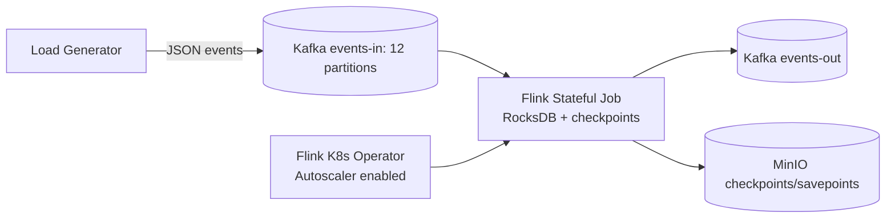

# Flink Elasticity PoC (Snowflake-Style Behavior on Minikube)

This project demonstrates warehouse-like compute elasticity for Apache Flink on a single Linux VM:
- metric-driven scale-up under load (horizontal: more TaskManagers),
- scale-down during low utilization (horizontal),
- vertical scale-up: a bigger TaskManager at constant parallelism,
- suspend-to-zero with savepoint,
- resume-from-savepoint with Kafka backlog drain.

## Documentation

| Document | What it covers |
| --- | --- |
| [`docs/SETUP-AND-RUN.md`](docs/SETUP-AND-RUN.md) | Step-by-step install, running the scenarios, the web console, and troubleshooting. Start here. |
| [`docs/BACKEND.md`](docs/BACKEND.md) | The Java Flink job class by class, the Python load generator, every Kubernetes YAML file one by one, the console server, and the shell scripts. |
| [`docs/FRONTEND.md`](docs/FRONTEND.md) | The web console UI: architecture, live data flow, state handling, and every component. |
| [`ARTICLE.md`](ARTICLE.md) | Narrative walkthrough of the PoC with the full runbook. |
| [`ARTICLE-checkpoints-vs-savepoints.md`](ARTICLE-checkpoints-vs-savepoints.md) | The campaign told as a story, explaining checkpoints and savepoints. |

The rest of this file is the condensed operational reference.

## Architecture



## Snowflake Concept Mapping

- Warehouse resize, multi-cluster (horizontal): autoscaler changes vertex parallelism and TaskManager pod count — S2/S3.
- Warehouse resize, T-shirt size (vertical): TaskManager CPU/memory enlarged at constant parallelism — S7.
- Auto-suspend: patch FlinkDeployment state to suspended with savepoint mode.
- Auto-resume: patch state to running and restore from savepoint.

## Repository Layout

```text
flink-elasticity-poc/
├── README.md
├── setup.sh
├── teardown.sh
├── versions.env
├── manifests/
│   ├── cert-manager/
│   ├── flink-operator/
│   ├── storage/
│   ├── kafka/
│   ├── loadgen/
│   ├── flink-jobs/
│   └── metrics/
├── job/
├── loadgen/
└── scripts/
```

## Resource Envelope Rules

At setup start, host resources are detected with `nproc`, `free -g`, `df -h` and minikube is sized as:
- CPUs: `total_cpus - 2`, clamped to [4, 8]
- Memory: `total_mem_gb - 4`, clamped to [8, 16]
- If host is below 4 CPU / 8 GB, reduced-footprint fallback is used with warning.

About 20% headroom is reserved in the printed budget table for scale events.

## Component Versions

Pinned versions are defined in `versions.env`. No `latest` tags are used.

## Kafka Topology Choice

- Preferred path: Strimzi operator + single-broker KRaft cluster when CPU envelope >= 6.
- Fallback path: single StatefulSet Kafka KRaft broker when CPU envelope < 6.

Fallback tradeoff:
- fewer operator abstractions and less production parity,
- still functionally valid for autoscaling, suspend/resume, and lag-based behavior checks.

## Partition and Parallelism Notes

`events-in` has 12 partitions. For source parallelism up to 6, each subtask can be assigned at least one partition, avoiding systematic idle source subtasks. Partition count does not need to exceed all future parallelism, but too few partitions can cap effective source parallelism.

## Flink Runtime Configuration Highlights

- Flink version: 1.20.x
- state backend: RocksDB
- incremental checkpoints: enabled
- checkpoint interval: 30 seconds
- `pipeline.max-parallelism: 120`

Why max parallelism is high from day one:
- key-group partitioning for state uses max parallelism.
- lowering/altering it later can break state compatibility for restore/rescale.

## Autoscaler Knobs (Plain-English)

- `job.autoscaler.enabled`: turns autoscaling on for the job.
- `job.autoscaler.stabilization.interval`: minimum time to stabilize before applying repeated changes.
- `job.autoscaler.metrics.window`: observation window used for utilization decisions.
- `job.autoscaler.target.utilization`: desired utilization point.
- `job.autoscaler.target.utilization.boundary`: tolerance around target before action is taken.
- `job.autoscaler.scale-down.interval`: minimum wait before reducing parallelism.
- `job.autoscaler.vertex.min-parallelism`: lower bound per vertex.
- `job.autoscaler.vertex.max-parallelism`: upper bound per vertex.

## Setup

```bash
cd flink-elasticity-poc
./setup.sh
# optional metrics
./setup.sh --with-metrics
# optional web console (installs and builds console/, see "Web Console" below)
./setup.sh --with-console
```

## Observability Helpers

```bash
scripts/ui.sh      # Flink Web UI at localhost:8081
scripts/watch.sh   # TM count, lag, and autoscaler events loop
scripts/console.sh # Web console: live data flow, telemetry, one-click scenarios
```

## Web Console

A purpose-built web console (`console/`) makes the elasticity story legible
without reading Flink Web UI panes or terminal PASS/FAIL lines: a live, animated
data-flow map from the load generator through Kafka and the Flink job graph to
`events-out`, live topic previews, an elasticity telemetry dashboard, and
one-click execution of S1–S7 with streamed logs and parsed outcomes. The
telemetry dashboard covers both scaling dimensions: per-vertex parallelism
series and TaskManager count for the horizontal story (S2/S3), and a
TaskManager-size tile plus a busiest-vertex busy-time chart for the vertical
story (S7) — the busy series visibly steps down when S7 enlarges the
TaskManager. It does not
replace the Flink Web UI and does not re-implement any scenario or metric-derivation
logic — it is a reader and orchestrator layered on the existing scripts.

```
                    ┌──────────────────────────── Host VM ───────────────────────────┐
                    │                                                                  │
  Browser           │   BFF service (Node + TypeScript, Fastify)                       │
 ┌─────────┐  WS/   │  ┌───────────────┐   ┌──────────────────────────────────────┐   │
 │ React   │◀─SSE──▶│  │ Aggregator +  │──▶│ Flink REST  (managed port-forward)    │──▶│──▶ JobManager
 │ SPA     │  REST  │  │ Stream hub    │   │ Kubernetes  (@kubernetes/client-node) │   │
 │ (Vite)  │──────▶ │  │               │   │ Kafka peek  (kubectl exec console-*)   │──▶│──▶ Kafka pod
 └─────────┘        │  │ Scenario      │──▶│ scripts/s1..s7.sh  (child_process)     │   │
                    │  │ runner        │   │ scripts/set-load.sh, common.sh helpers │   │
                    │  └───────────────┘   └──────────────────────────────────────┘   │
                    └──────────────────────────────────────────────────────────────────┘
```

**Run it:**

```bash
scripts/console.sh            # read-only: all observability, no mutating actions
scripts/console.sh --operate  # enables load control and running S1–S7 from the UI
```

The first run installs and builds `console/` if it hasn't been built yet (or run
`./setup.sh --with-console` ahead of time). The console binds to `127.0.0.1` only;
remote exposure is opt-in and out of scope for this PoC. It owns its own `kubectl
port-forward` to the Flink REST service and tears it down on exit — no orphaned
forwards.

**Access strategy and tradeoffs** (see `openspec/changes/flink-elasticity-web-console/design.md`
for the full rationale): the console is a host-run backend-for-frontend, not an
in-cluster service, so it can reuse `scripts/common.sh` and the `sN-*.sh` scripts
verbatim as the single source of truth — no forked orchestration or pass/fail
logic. TaskManager count, `FlinkDeployment` state, and autoscaler events come from
the Kubernetes API directly; Flink job graph and per-vertex metrics come from a
backend-managed Flink REST port-forward; Kafka topic previews and consumer-group
lag are read via bounded `kubectl exec kafka-console-consumer.sh` /
`kafka-consumer-groups.sh` calls, mirroring `common.sh`, rather than a native Kafka
client — this sidesteps the single broker's cluster-internal advertised-listener
DNS name, which a host-side client would otherwise need to work around.

Note: those `kubectl exec` reads run a small JVM *inside* the broker's own
container, which is memory-constrained on this PoC's single-VM footprint. The
console deliberately polls consumer-group lag and topic previews on a much
longer cadence (tens of seconds) than the lightweight Kubernetes/Flink REST
reads, and never overlaps two such execs — polling this any more aggressively
can OOM-kill the broker pod.

**Operate vs. read-only mode:** by default the console starts read-only — every
observability panel (topology, previews, telemetry, scenario status) works, but
load changes and scenario runs are disabled. `--operate` enables them, and the UI
still requires an explicit confirmation before any mutating action (load change,
or running S2–S7) — S1 is non-mutating and available in both modes. No kubeconfig
credentials or cluster secrets are ever sent to the browser.

**Mapping to the scenarios:** the console's scenario control panel runs the exact
`scripts/sN-*.sh` scripts unchanged — S1 (baseline) is read-only; S2 (scale-up),
S3 (scale-down), S4 (suspend), S5 (resume), S6 (rescale cost), and S7 (vertical
scale) all mutate the
cluster and require operate mode plus confirmation. Each run streams the script's
stdout live and parses its final `PASS|FAIL S<n> ...` line into the same
counts/timings the terminal runbook reports, so the console's outcome should
always match what running the script directly would show.

## Scenario Runbook

Run in order:

```bash
scripts/s1-baseline.sh
scripts/s2-scale-up.sh
scripts/s3-scale-down.sh
scripts/s4-suspend.sh
scripts/s5-resume.sh
scripts/s6-rescale-cost.sh
scripts/s7-vertical-scale.sh
```

**Horizontal vs. vertical scaling:** S2/S3 demonstrate *horizontal* scaling — the
autoscaler changes vertex parallelism, which adds or removes TaskManager pods of
a fixed size — and S6 measures the cost of doing that manually. S7 demonstrates
*vertical* scaling: the TaskManager itself is enlarged (double CPU, +1GiB memory)
at constant parallelism and TM count, and the script shows the per-TM capacity
gain as a drop in `busyTimeMsPerSecond` at a fixed event rate. The measurement
load is deliberately kept below the autoscaler's 0.6 utilization target so the
horizontal autoscaler stays quiet; if it does interfere, S7 fails explicitly
rather than reporting a confounded result. Both paths go through the same
operator savepoint-upgrade cycle, so both have a comparable restart gap — which
is why S7 reports `resize_gap_s` alongside the busy-time delta. Baseline
TaskManager resources are restored automatically when the script exits.

Each script:
- uses strict shell safety (`set -euo pipefail`),
- validates prerequisites,
- prints expected outcomes,
- prints a final PASS/FAIL summary with measured timings.

## Reference results on this VM

Captured on the target VM (8 vCPU minikube node, docker driver). Both scenarios
passed. Values are the measured output of `scripts/s1-baseline.sh` and
`scripts/s2-scale-up.sh`.

- S1 baseline (`PASS S1 baseline tm_count=1 pendingRecords=0 lag=900 checkpoint_age_s=298`):
  - TM pods: 1 (steady-state baseline, `parallelism.default=1`)
  - source pendingRecords (real-time backlog): 0 — pipeline fully caught up
  - consumer-group lag: ~900 (informational only — see note below)
  - checkpoint age: ~298 s (checkpoints completing to MinIO)
- S2 scale-up (`PASS S2 scale-up rate=12000 base_tm=1 max_tm=2 scaleup_in_s=221 drain_in_s=105`):
  - target rate: 12,000 events/s (saturates a single TaskManager on this VM)
  - base TM pods: 1 → max TM pods: 2 (autoscaler added a TaskManager under load)
  - time to scale up: ~221 s (1 min stabilization + 3 min metrics window + rescale)
  - backlog-drain time after returning to baseline load: ~105 s

### Full campaign scorecard (S1–S7, run from the web console)

Final results of the end-to-end scenario campaign, executed from the web
console (`scripts/console.sh --operate`, parsed `PASS/FAIL` lines identical to
the script outputs). S1–S3 were captured 2026-07-28; S4–S6 were captured
2026-07-29 after the criteria adaptations described below; S7 was captured
2026-07-30 when the vertical-scaling scenario was added. This scorecard
supersedes the interim notes in the archived
`flink-elasticity-web-console` change.

| Scenario | Result | Summary line |
| --- | --- | --- |
| S1 baseline | PASS | `PASS S1 baseline tm_count=1 pendingRecords=0 lag=0 checkpoint_age_s=276` |
| S2 scale-up | PASS | `PASS S2 scale-up rate=12000 base_tm=1 max_tm=2 scaleup_in_s=207 drain_in_s=225` |
| S3 scale-down | PASS | `PASS S3 scale-down from_tm=2 to_tm=1 scale_down_time_s=474` |
| S4 suspend | PASS | `PASS S4 suspend savepoints=24 pod_count=0 suspend_s=10 elapsed_s=23` |
| S5 resume | PASS | `PASS S5 resume cold_start_to_checkpoint_s=149 backlog_drain_s=149 pending_records=0` |
| S6 rescale cost | PASS | `PASS S6 rescale-cost small_gap_s=112 large_gap_s=112` |
| S7 vertical scale | PASS | `PASS S7 vertical-scale base_cpu=0.5 new_cpu=1 busy_before=183 busy_after=74 resize_gap_s=103 tm_count=1` |

Criteria adaptations made for the deployed 1.20 stack (see the deployment
caveat below for the underlying stack behavior):

- **S4** now passes on the operator's `lifecycleState=SUSPENDED` plus savepoint
  objects in MinIO, then applies the documented JobManager-deployment fix-up
  itself and verifies zero pods — the 1.20 adaptive-scheduler JobManager never
  self-terminates, so raw zero-pods was unsatisfiable.
- **S5** judges backlog drain on the source's authoritative `pendingRecords`
  instead of consumer-group lag, which is checkpoint-cadence-distorted at
  300 ev/s (see notes below); lag is still printed as informational output.
- **S6** measurement fixes: the restart gap is anchored on the operator
  redeploying the job under a new jobId (previously it could sample the old,
  still-RUNNING job and report a ~1s gap), stability uses `pendingRecords`
  rather than consumer lag, and `kubectl` stdout no longer pollutes the
  captured gap value. The ~112s gap is dominated by the operator's fixed
  savepoint-upgrade redeploy cycle; 15 minutes of additional state at
  500 ev/s did not measurably increase it on this small-state job.

### Notes on the metrics

- **Consumer-group lag is an offset-commit artifact.** The Flink Kafka source
  commits offsets to the consumer group only on checkpoint (~every 30 s), so the
  reported consumer-group lag sawtooths to large values under continuous load
  even while the pipeline is fully caught up. The authoritative real-time backlog
  is the source's `pendingRecords` metric, which stays ~0 at baseline and drains
  to 0 after scale-up. S1/S2 judge success on `pendingRecords` (and TM count for
  scale-up), using consumer-group lag only as an informational load indicator.
- **Baseline is `parallelism.default=1` by design.** The single-process Python
  load generator tops out at ~12k events/s, which saturates roughly one
  TaskManager. A 1-TM baseline makes the scale-up in S2 observable end-to-end; a
  2-TM baseline could not be saturated by one load generator.

### Deployment caveat (degraded stack)

These results were captured on the **deployed** stack, which is **Flink 1.20.1
with Flink Kubernetes Operator 1.12**, not the repository's on-disk upgraded
Flink **2.2.1**. Reasons:

- No Flink 2.2.1 job image was built/loaded on this VM.
- Operator 1.12 only reconciles `flinkVersion` values up to `v1_20`, so it rejects
  the on-disk manifest's `flinkVersion: v2_2`.

To run the scenarios against the live 1.20 operator, deploy with the version
rewritten to `v1_20`:

```bash
sed 's/flinkVersion: v2_2/flinkVersion: v1_20/' \
  manifests/flink-jobs/flink-job.yaml > /tmp/flink-job-live.yaml
kubectl apply -f /tmp/flink-job-live.yaml
```

The application code and job logic are identical; only the runtime/operator
versions differ from the upgraded repository targets.

Known behavioral differences observed on the deployed 1.20.1 stack:

- **S4 suspend leaves the JobManager pod running.** Savepoint-suspend completes
  correctly (savepoint written to MinIO, job reaches FINISHED, the TaskManager
  pod is removed), but the native-mode JobManager deployment does not
  self-terminate under the adaptive scheduler. `s4-suspend.sh` therefore passes
  on the operator's `SUSPENDED` lifecycle state and then deletes the deployment
  itself (`kubectl -n flink-jobs delete deployment flink-elastic-job`) to
  complete the suspend-to-zero state; S5 resume works normally afterwards.
- **Component memory limits were raised after observed OOM kills**: `kafka-0`
  1Gi → 1536Mi (broker heap plus exec'd Kafka CLI JVMs from the runbook and
  console exceeded 1Gi under S2 load) and the operator 768Mi → 1536Mi (it was
  OOM-crash-looping every ~11 minutes, stalling the autoscaler and destabilizing
  scenario runs). The manifests carry the new values.

## Teardown

```bash
./teardown.sh
```
