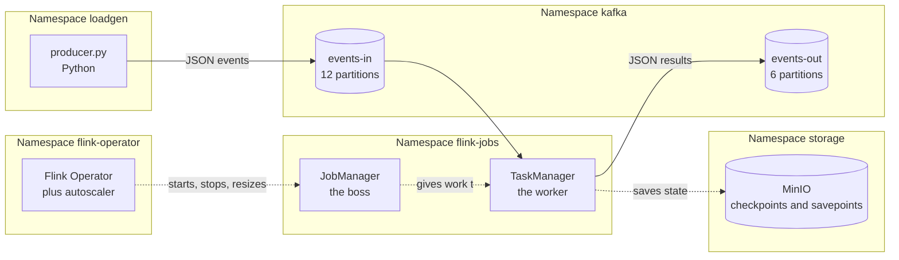
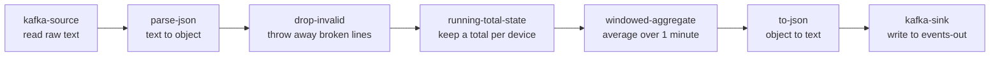
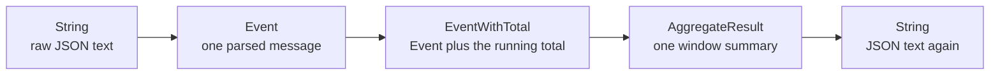
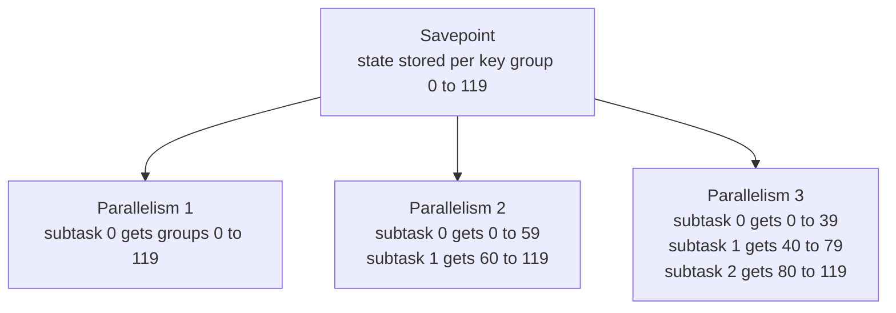
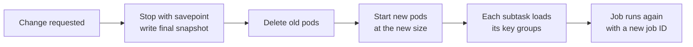
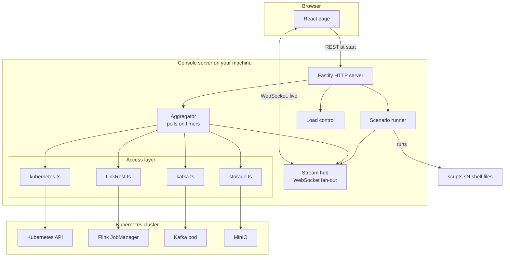

# Backend Documentation

This document explains everything that runs on the server side of this project:

- **Part 1** — the big picture
- **Part 2** — the Java Flink job, class by class
- **Part 3** — the load generator (Python)
- **Part 4** — every Kubernetes YAML file, one by one
- **Part 5** — the web console server (Node.js)
- **Part 6** — the shell scripts

The language is kept simple. Technical words are explained when they first appear.

**Related documents:** [`SETUP-AND-RUN.md`](SETUP-AND-RUN.md) · [`FRONTEND.md`](FRONTEND.md)

---

## Table of contents

**Part 1 — The big picture**
- [1.1 What the backend is made of](#11-what-the-backend-is-made-of)
- [1.2 How data flows](#12-how-data-flows)

**Part 2 — The Java Flink job**
- [2.1 Where the files are](#21-where-the-files-are)
- [2.2 The job graph](#22-the-job-graph)
- [2.3 `main()` step by step](#23-main-step-by-step)
- [2.4 Reading from Kafka](#24-reading-from-kafka)
- [2.5 Parsing JSON](#25-parsing-json)
- [2.6 The data records](#26-the-data-records)
- [2.7 `RunningTotalFunction` — the stateful part](#27-runningtotalfunction--the-stateful-part)
- [2.8 `SlidingAggregateWindow` — the window part](#28-slidingaggregatewindow--the-window-part)
- [2.9 Writing to Kafka](#29-writing-to-kafka)
- [2.10 Why this job can grow and shrink](#210-why-this-job-can-grow-and-shrink)
- [2.11 `pom.xml` — how the job is built](#211-pomxml--how-the-job-is-built)
- [2.12 `Dockerfile` — how the image is made](#212-dockerfile--how-the-image-is-made)
- [2.13 Tests](#213-tests)

**Part 3 — The load generator**
- [3.1 `producer.py`](#31-producerpy)

**Part 4 — Kubernetes YAML files**
- [4.0 How to read this part](#40-how-to-read-this-part)
- [4.1 `flink-jobs/flink-job.yaml`](#41-manifestsflink-jobsflink-jobyaml)
- [4.2 `flink-operator/values.yaml`](#42-manifestsflink-operatorvaluesyaml)
- [4.3 `kafka/namespace.yaml`](#43-manifestskafkanamespaceyaml)
- [4.4 `kafka/strimzi-kafka.yaml`](#44-manifestskafkastrimzi-kafkayaml)
- [4.5 `kafka/fallback-kafka.yaml`](#45-manifestskafkafallback-kafkayaml)
- [4.6 `storage/minio.yaml`](#46-manifestsstorageminioyaml)
- [4.7 `loadgen/loadgen.yaml`](#47-manifestsloadgenloadgenyaml)
- [4.8 `metrics/prometheus.yaml`](#48-manifestsmetricsprometheusyaml)
- [4.9 The `kustomization.yaml` files](#49-the-kustomizationyaml-files)
- [4.10 Secrets created by the setup script](#410-secrets-created-by-the-setup-script)

**Part 5 — The web console server**
- [5.1 Why it exists](#51-why-it-exists)
- [5.2 Architecture](#52-architecture)
- [5.3 The access layer](#53-the-access-layer)
- [5.4 The services layer](#54-the-services-layer)
- [5.5 The HTTP and WebSocket API](#55-the-http-and-websocket-api)
- [5.6 Safety rules](#56-safety-rules)

**Part 6 — Shell scripts**
- [6.1 Script map](#61-script-map)

---

# Part 1 — The big picture

## 1.1 What the backend is made of

The backend is five separate things that work together:

| Piece | Language | What it does |
|---|---|---|
| **Flink job** | Java 21 | Reads events, keeps totals, calculates windows, writes results |
| **Load generator** | Python 3.12 | Creates fake sensor events and sends them to Kafka |
| **Kubernetes manifests** | YAML | Describe every piece so Kubernetes can start them |
| **Console server** | TypeScript / Node.js | Reads the live cluster and serves the web page |
| **Shell scripts** | Bash | Run the tests and print PASS or FAIL |

## 1.2 How data flows



**Reading the diagram:** the load generator makes events. Kafka holds them. The
Flink TaskManager processes them and writes results back to Kafka. Every 30
seconds the TaskManager saves its memory into MinIO. The Operator watches
everything and decides when to add or remove TaskManagers.

---

# Part 2 — The Java Flink job

## 2.1 Where the files are

```text
job/
├── pom.xml                          # build settings and library list
├── Dockerfile                       # how to build the container image
├── docker-entrypoint.sh             # the start-up script inside the image
└── src/
    ├── main/java/com/example/flinkelasticity/
    │   └── ElasticityJob.java       # the whole job, one file
    └── test/java/com/example/flinkelasticity/
        ├── ElasticityJobTest.java          # tests for the plain logic
        └── RunningTotalFunctionTest.java   # test for the stateful part
```

The entire job is **one Java file with 230 lines**. This is on purpose: the
project is about elasticity, not about complex business logic.

## 2.2 The job graph

Flink turns your code into a **graph**. Each box in the graph is called a
**vertex**. Flink can run several copies of one vertex at the same time; each
copy is a **subtask**.



Flink joins steps that do not need to move data between machines. This is
called **chaining**. After chaining, this job has **three vertices**:

| Vertex (real name) | Contains | Has state? |
|---|---|---|
| `Source: kafka-source -> parse-json -> drop-invalid` | reading, parsing, filtering | Kafka read positions |
| `running-total-state` | the running total per device | **Yes** — a value per device |
| `windowed-aggregate -> to-json -> kafka-sink-events-out` | windows, formatting, writing | **Yes** — events waiting in windows |

You will see these three names in the console, in the Flink web page, and in
the scenario logs.

## 2.3 `main()` step by step

The `main()` method builds the graph. Here is what each part does.

**Step 1 — read settings from the environment**

```java
String bootstrap = envOrDefault("KAFKA_BOOTSTRAP_SERVERS", "kafka.kafka.svc.cluster.local:9092");
String inTopic   = envOrDefault("KAFKA_INPUT_TOPIC",  "events-in");
String outTopic  = envOrDefault("KAFKA_OUTPUT_TOPIC", "events-out");
String groupId   = envOrDefault("KAFKA_GROUP_ID",     "flink-elastic-consumer");
```

`envOrDefault` reads an environment variable. If the variable is missing or
empty, it uses the default value instead. This means the job works with no
configuration at all, but you can still change it without rebuilding.

**Step 2 — create the execution environment**

```java
StreamExecutionEnvironment env = StreamExecutionEnvironment.getExecutionEnvironment();
```

This object is the builder for the whole job. Note that the code does **not**
set parallelism, checkpoint interval, or state backend here. Those come from
the YAML file instead (see [section 4.1](#41-manifestsflink-jobsflink-jobyaml)).
That is important: it means the Operator can change them without touching the code.

**Step 3 — connect the pieces**

```java
DataStream<String> input = env.fromSource(source, WatermarkStrategy.noWatermarks(), "kafka-source");

DataStream<Event> parsed = input
    .map(raw -> parse(raw)).returns(TypeInformation.of(Event.class)).name("parse-json")
    .filter(e -> e != null).name("drop-invalid");

KeyedStream<Event, String> keyed = parsed.keyBy(Event::deviceId);

DataStream<EventWithTotal> withTotals = keyed
    .process(new RunningTotalFunction()).name("running-total-state");

DataStream<AggregateResult> aggregated = withTotals
    .keyBy(EventWithTotal::deviceId)
    .window(SlidingProcessingTimeWindows.of(Duration.ofMinutes(1), Duration.ofSeconds(10)))
    .process(new SlidingAggregateWindow()).name("windowed-aggregate");
```

Two details worth knowing:

- **`WatermarkStrategy.noWatermarks()`** — watermarks are Flink's way of
  handling events that arrive late or out of order. This job does not use
  them, because the windows use *processing time* (the clock on the machine),
  not *event time* (the timestamp inside the message). This keeps the demo simple.
- **`.name(...)`** — gives each step a readable name. These names appear in the
  Flink web page, in the console, and in the scenario output. Without them you
  would see machine-generated names that are hard to read.

**Step 4 — start the job**

```java
env.execute("flink-elasticity-job");
```

Nothing runs until this line. Everything before it only describes the graph.

## 2.4 Reading from Kafka

```java
static KafkaSource<String> buildKafkaSource(String bootstrap, String inTopic, String groupId) {
    return KafkaSource.<String>builder()
        .setBootstrapServers(bootstrap)
        .setTopics(inTopic)
        .setGroupId(groupId)
        .setStartingOffsets(OffsetsInitializer.committedOffsets(OffsetResetStrategy.LATEST))
        .setValueOnlyDeserializer(new SimpleStringSchema())
        .build();
}
```

| Setting | Meaning |
|---|---|
| `setBootstrapServers` | The address of Kafka |
| `setTopics` | Which channel to read — `events-in` |
| `setGroupId` | The name Kafka uses to remember our reading position |
| `setStartingOffsets` | Where to begin the very first time. `committedOffsets(LATEST)` means: continue from the saved position; if there is none, start from the newest message |
| `setValueOnlyDeserializer` | Read the message body as plain text. Ignore the key |

**An important point about reading positions.** Flink does **not** trust Kafka
to remember where it was. Flink keeps the read position inside its own state,
and writes it into every checkpoint. It also tells Kafka the position, but only
when a checkpoint finishes — so about every 30 seconds.

This has one big effect you will see everywhere in this project: the number
Kafka reports as "consumer lag" jumps up and down like a saw, even when the
job is perfectly up to date. The real backlog is a Flink metric called
`pendingRecords`. All the test scripts use `pendingRecords`, never Kafka lag.

There is also a `@SuppressWarnings("deprecation")` on this method. The Flink
Kafka connector only accepts an old Kafka class here. The suppression is placed
on this one small method so the rest of the file still gets full warnings.

## 2.5 Parsing JSON

```java
static Event parse(String raw) {
    try {
        JsonNode node = MAPPER.readTree(raw);
        return new Event(
            node.path("device_id").asText(),
            node.path("event_type").asText(),
            node.path("value").asDouble(),
            node.path("ts").asText()
        );
    } catch (Exception e) {
        return null;
    }
}
```

Two design choices:

- **`node.path(...)` instead of `node.get(...)`** — `path` returns an empty node
  when the field is missing, instead of `null`. This means a message with a
  missing field still produces an `Event` rather than crashing.
- **Returns `null` on broken JSON** — the next step, `drop-invalid`, throws
  those away. One bad message can never stop the whole job.

The JSON library used is `org.apache.flink.shaded.jackson2...`. **Shaded** means
Flink bundles its own private copy of the library under a different name. Using
Flink's copy avoids version conflicts with any other Jackson on the classpath.

## 2.6 The data records

Java `record` is a short way to declare a class that only holds values. The
three records here are the data as it moves through the graph:

```java
public record Event(String deviceId, String eventType, double value, String ts) {}

public record EventWithTotal(String deviceId, String eventType, double value,
                             String ts, double runningTotal) { ... }

public record AggregateResult(String deviceId, long count, double avgValue,
                              double runningTotal, long windowStart, long windowEnd) {
    public String toJson() { ... }
}
```



`AggregateResult.toJson()` builds the output message by hand into a map and
then writes it as JSON. It also adds `emitted_at`, the current time in
milliseconds, which is useful when reading the output topic. If writing fails
it returns `"{}"` instead of throwing — again, one bad record never stops the job.

## 2.7 `RunningTotalFunction` — the stateful part

This is the most important class for understanding elasticity.

```java
public static class RunningTotalFunction extends KeyedProcessFunction<String, Event, EventWithTotal> {

    private transient ValueState<Double> totalState;

    @Override
    public void open(OpenContext openContext) {
        ValueStateDescriptor<Double> descriptor =
            new ValueStateDescriptor<>("running-total", Double.class);
        totalState = getRuntimeContext().getState(descriptor);
    }

    @Override
    public void processElement(Event event, Context ctx, Collector<EventWithTotal> out) throws Exception {
        Double total = totalState.value();
        if (total == null) total = 0.0;
        total += event.value();
        totalState.update(total);
        out.collect(new EventWithTotal(event, total));
    }
}
```

**What "keyed state" means.** The stream was grouped by `deviceId` with
`keyBy`. Because of that, `totalState` is **not one value** — it is one value
*per device*. When a message for `device-042` arrives, Flink automatically
gives you the state slot belonging to `device-042`. You never write that
lookup yourself.

| Line | Why it is written that way |
|---|---|
| `private transient ValueState<Double>` | `transient` means "do not save this field with normal Java serialization". Flink manages the state itself. |
| `open(...)` | Runs once when the subtask starts. This is where you must ask Flink for the state handle. |
| `totalState.value()` returning `null` | The first time a device is seen, there is no value yet. The code treats that as zero. |
| `totalState.update(total)` | This writes to RocksDB. RocksDB is the on-disk database Flink uses to hold state that is too big for memory. |

**Why this matters for elasticity:** this state cannot be recalculated. It has
been adding up since the job started. So when the job grows from 1 to 2
TaskManagers, half of these totals must physically move to the new machine
without a single value being lost or counted twice. That is exactly what
savepoints and key groups do — see section 2.10.

## 2.8 `SlidingAggregateWindow` — the window part

```java
.window(SlidingProcessingTimeWindows.of(Duration.ofMinutes(1), Duration.ofSeconds(10)))
```

A **sliding window** is a time box that moves forward in steps:

- **Size = 1 minute** — each box covers 60 seconds of events.
- **Slide = 10 seconds** — a new box starts every 10 seconds.

Because 60 ÷ 10 = 6, **every event belongs to 6 windows at the same time**.
This means the job emits results every 10 seconds, and it also means the window
step holds a fair amount of state.

The actual math is in a separate static method:

```java
static AggregateResult aggregate(String key, Iterable<EventWithTotal> events,
                                 long windowStart, long windowEnd) {
    long count = 0; double sum = 0; double latestTotal = 0;
    for (EventWithTotal e : events) {
        count++;
        sum += e.value();
        latestTotal = e.runningTotal();
    }
    if (count == 0) return null;
    return new AggregateResult(key, count, sum / count, latestTotal, windowStart, windowEnd);
}
```

It was pulled out of the window class on purpose, so a unit test can call it
directly with a plain list — no Flink runtime needed. See section 2.13.

## 2.9 Writing to Kafka

```java
KafkaSink<String> sink = KafkaSink.<String>builder()
    .setBootstrapServers(bootstrap)
    .setRecordSerializer(
        KafkaRecordSerializationSchema.builder()
            .setTopic(outTopic)
            .setValueSerializationSchema(new SimpleStringSchema())
            .build())
    .build();
```

The job also has a second output:

```java
aggregated.map(AggregateResult::toJson).returns(Types.STRING).print().name("print-sink");
```

`print()` writes every result to the TaskManager's log. This is handy while
learning — you can run `kubectl logs` on the TaskManager pod and watch results
appear. In a real production job you would remove this, because it makes the
logs very large.

## 2.10 Why this job can grow and shrink

This section ties the code to the elasticity story.

**Key groups.** Flink never stores state "for TaskManager number 2". Instead it
hashes each key (here, `deviceId`) into one of a fixed number of buckets called
**key groups**. This job has 120 of them (`pipeline.max-parallelism: 120` in the
YAML). A snapshot is organized by key group. Parallelism only decides how the
120 groups are shared out:



The same snapshot restores at any parallelism. That is why a resize is possible
at all.

**The one setting you can never change:** `pipeline.max-parallelism`. If you
change the number of key groups, every key hashes into a different bucket, and
all your existing state becomes unreachable. That is why the YAML sets it to
120 from day one, even though the job normally runs with parallelism 1.

**How a resize actually happens.** The Operator does not move state while the
job runs. It does this instead:



This takes about 100 to 112 seconds in this project, measured by scenarios S6
and S7. The time is almost all fixed cost — stopping, scheduling, starting
Java, opening RocksDB — not the size of the state.

**Important:** the same steps run whether you change *parallelism* (horizontal,
more workers) or *TaskManager size* (vertical, bigger workers). The Operator
does not care which one changed; any change to the specification causes a
savepoint round trip.

## 2.11 `pom.xml` — how the job is built

Maven is the build tool for Java. `pom.xml` tells it what to do.

**Java and Flink versions:**

```xml
<maven.compiler.source>21</maven.compiler.source>
<maven.compiler.target>21</maven.compiler.target>
<flink.version>2.2.1</flink.version>
```

**Libraries and their scope:**

| Library | Scope | Why |
|---|---|---|
| `flink-streaming-java` | `provided` | The Flink container already has it. Do not put it in our jar. |
| `flink-clients` | `provided` | Same reason. |
| `flink-connector-kafka` (5.0.0-2.2) | default | **Not** in the container. Must be inside our jar. |
| `flink-json` | default | Same reason. |
| `slf4j-api`, `slf4j-simple` | default | Logging. |
| `junit-jupiter` and Flink test jars | `test` | Only used when running tests. |

**`provided` is the key idea here.** It means "this library exists at runtime,
do not bundle it". If you bundled Flink itself, the jar would be huge and could
clash with the container's own copy.

**The shade plugin:**

```xml
<artifactId>maven-shade-plugin</artifactId>
...
<mainClass>com.example.flinkelasticity.ElasticityJob</mainClass>
```

Shading packs your code **and all non-provided libraries** into one single jar
file — sometimes called a "fat jar". This is what gets copied into the image.
The `mainClass` line records which class to start.

**The surefire plugin:**

```xml
<argLine>--add-opens=java.base/java.util=ALL-UNNAMED --add-opens=java.base/java.lang=ALL-UNNAMED</argLine>
```

Java 17 and newer block libraries from reaching into Java's own internals.
Flink's test tools need that access for serialization. These two flags open
just those two packages, and only during tests.

## 2.12 `Dockerfile` — how the image is made

The Dockerfile has **two stages**. This keeps the final image small.

**Stage 1 — build:**

```dockerfile
FROM maven:3.9.16-eclipse-temurin-21 AS builder
WORKDIR /workspace
COPY pom.xml .
COPY src ./src
RUN mvn -q -DskipTests package
```

This stage has Maven and the full JDK. It produces the fat jar. None of this
ends up in the final image.

**Stage 2 — run:**

```dockerfile
FROM flink:2.2.1-scala_2.12-java21
WORKDIR /opt/flink/usrlib
RUN mkdir -p /opt/flink/plugins/s3-fs-hadoop && \
    ln -sf /opt/flink/opt/flink-s3-fs-hadoop-2.2.1.jar \
           /opt/flink/plugins/s3-fs-hadoop/flink-s3-fs-hadoop-2.2.1.jar
RUN mv /docker-entrypoint.sh /docker-entrypoint-original.sh
COPY docker-entrypoint.sh /docker-entrypoint.sh
RUN chmod +x /docker-entrypoint.sh
COPY --from=builder /workspace/target/flink-elastic-job-0.1.0.jar /opt/flink/usrlib/flink-elastic-job.jar
```

Three things happen here:

1. **The S3 plugin is switched on.** Flink ships the S3 file system driver in
   `/opt/flink/opt/`, but does not load it. Creating a link inside
   `/opt/flink/plugins/` activates it. Without this, the job cannot write
   checkpoints to MinIO.
2. **The start-up script is replaced.** See below.
3. **The jar is copied in** at `/opt/flink/usrlib/flink-elastic-job.jar`. That
   exact path appears in the YAML as `jarURI`.

**Why the custom `docker-entrypoint.sh`?** The original script writes Flink's
configuration directly into `/opt/flink/conf`, which is read-only in this
setup. The replacement copies the configuration to a writable temporary folder
first:

```bash
if [[ -d /opt/flink/conf ]]; then
  rm -rf /tmp/flink-conf
  mkdir -p /tmp/flink-conf
  cp -a /opt/flink/conf/. /tmp/flink-conf/
  chmod -R u+w /tmp/flink-conf
  export FLINK_CONF_DIR=/tmp/flink-conf
fi
```

Everything else in the script is the same as the original: it reads the
`FLINK_PROPERTIES` environment variable that the Operator sets, applies those
settings, and then starts either the JobManager or the TaskManager depending on
the first argument.

## 2.13 Tests

Two test files, testing two different kinds of code.

**`ElasticityJobTest.java` — plain logic, no Flink needed.**

Tests `parse()` and `aggregate()` by calling them directly:

- Valid JSON produces the right `Event`.
- Broken JSON (like `{` or `{"value":}`) returns `null`.
- `aggregate()` computes the correct count, average, and latest total.
- An empty window returns `null`.

**`RunningTotalFunctionTest.java` — stateful logic, Flink harness needed.**

State cannot be tested by calling a method. Flink provides a **test harness**
that fakes the runtime:

```java
try (KeyedOneInputStreamOperatorTestHarness<String, Event, EventWithTotal> harness =
         ProcessFunctionTestHarnesses.forKeyedProcessFunction(
             new RunningTotalFunction(), Event::deviceId, Types.STRING)) {
    harness.open();
    // push events in, check the totals that come out
}
```

This proves the running total adds up correctly per device key.

Run the tests with:

```bash
cd job
mvn test
```

---

# Part 3 — The load generator

## 3.1 `producer.py`

A small Python program that creates fake sensor data. 83 lines.

**Settings, all from environment variables:**

| Variable | Default | Meaning |
|---|---|---|
| `KAFKA_BOOTSTRAP_SERVERS` | `kafka.kafka.svc.cluster.local:9092` | Where Kafka is |
| `KAFKA_TOPIC` | `events-in` | Which topic to write to |
| `EVENTS_PER_SEC` | `50` | How many events per second |

**The fake data:**

```python
DEVICE_IDS = [f"device-{i:03d}" for i in range(200)]
EVENT_TYPES = ["temp", "pressure", "vibration", "humidity"]
```

200 different devices. That number matters: it decides how many different keys
the Flink job has to keep state for.

Each message looks like this:

```json
{"device_id": "device-042", "event_type": "temp", "value": 73.412, "ts": "2026-07-30T09:15:00.123456+00:00"}
```

**How the rate is controlled:**

```python
while RUNNING:
    start = time.time()
    for _ in range(EVENTS_PER_SEC):
        producer.produce(TOPIC, key=..., value=...)
    producer.poll(0)
    elapsed = time.time() - start
    sleep_for = max(0.0, interval - elapsed)
    if sleep_for > 0:
        time.sleep(sleep_for)
```

It sends one full second of messages as fast as it can, then sleeps for the
rest of that second. If sending took longer than one second, it does not sleep
at all — so at very high rates the real speed is simply "as fast as possible".
On the reference machine that limit is about 12,000 events per second.

**Producer settings and why:**

| Setting | Value | Reason |
|---|---|---|
| `enable.idempotence` | `True` | Kafka will not store the same message twice if a retry happens |
| `linger.ms` | `5` | Wait 5 ms to gather messages into a batch. Fewer, bigger requests |
| `batch.size` | `32768` | Up to 32 KB per batch |
| `compression.type` | `lz4` | Compress batches. Fast, saves network |
| `acks` | `all` | Wait until Kafka confirms the write |

**Clean shutdown:** the program catches `SIGTERM` and `SIGINT`, stops the loop,
and calls `producer.flush(30)` to send anything still waiting. This is why
changing the load with `set-load.sh` never loses messages.

**The message key** is the device ID. Kafka uses the key to decide which
partition a message goes to. This means all messages for one device always land
in the same partition, which keeps their order.

---

# Part 4 — Kubernetes YAML files

## 4.0 How to read this part

Every YAML file describes objects you want to exist. Kubernetes then makes
reality match. Each object has four top-level fields:

| Field | Meaning |
|---|---|
| `apiVersion` | Which version of the Kubernetes API this object uses |
| `kind` | What type of object — `Pod`, `Service`, `Deployment`, and so on |
| `metadata` | Name, namespace, labels |
| `spec` | What you actually want |

A line with only `---` separates two objects inside one file.

**Files covered in this part:**

```text
manifests/
├── flink-jobs/
│   ├── flink-job.yaml          ← the most important file
│   └── kustomization.yaml
├── flink-operator/
│   ├── values.yaml             ← Helm settings, not a k8s object
│   └── kustomization.yaml
├── kafka/
│   ├── namespace.yaml
│   ├── strimzi-kafka.yaml
│   ├── fallback-kafka.yaml
│   └── kustomization.yaml
├── storage/
│   ├── minio.yaml
│   └── kustomization.yaml
├── loadgen/
│   ├── loadgen.yaml
│   └── kustomization.yaml
└── metrics/
    ├── prometheus.yaml
    └── kustomization.yaml
```

---

## 4.1 `manifests/flink-jobs/flink-job.yaml`

**This is the heart of the project.** Everything about elasticity is configured
here. 92 lines.

### Object 1 — the namespace

```yaml
apiVersion: v1
kind: Namespace
metadata:
  name: flink-jobs
```

Creates the folder where all Flink job pods will live.

### A note in the file about a missing Secret

The file contains a comment explaining that the `minio-s3-credentials` Secret
is **deliberately not** in this file. The setup script creates it with the real
passwords. If a placeholder version were in this file, running
`kubectl apply -f flink-job.yaml` would overwrite the real passwords with fake
ones, and the job would fail to write checkpoints with an "InvalidAccessKeyId"
error.

**Lesson:** never put a placeholder Secret in a file you re-apply.

### Object 2 — the FlinkDeployment

```yaml
apiVersion: flink.apache.org/v1beta1
kind: FlinkDeployment
metadata:
  name: flink-elastic-job
  namespace: flink-jobs
```

`FlinkDeployment` is a **custom resource**. That means it is not built into
Kubernetes — the Flink Operator added this type when it was installed. The
Operator watches for these objects and creates the real pods.

### Top-level settings

```yaml
spec:
  image: flink-elastic/job:0.1.1
  flinkVersion: v2_2
  serviceAccount: flink
  mode: native
```

| Setting | Meaning |
|---|---|
| `image` | The container image built by `setup.sh` from `job/Dockerfile` |
| `flinkVersion` | Which Flink version. `v2_2` means Flink 2.2 |
| `serviceAccount` | The identity the pods use to talk to Kubernetes |
| `mode: native` | Flink asks Kubernetes directly for TaskManager pods, instead of a fixed number being set in advance. This is what makes automatic scaling possible |

> **Common problem:** if your installed Operator is older, it may not accept
> `v2_2`. See [the troubleshooting section](SETUP-AND-RUN.md#10-when-something-goes-wrong)
> for the one-line fix.

### `flinkConfiguration` — Flink's own settings

This block is passed straight to Flink. Let us go through it in groups.

**Group 1 — parallelism**

```yaml
taskmanager.numberOfTaskSlots: "1"
parallelism.default: "1"
pipeline.max-parallelism: "120"
```

| Setting | Value | Why |
|---|---|---|
| `numberOfTaskSlots` | 1 | Each TaskManager pod runs one slot. So "more parallelism" always means "more pods" — which makes scaling visible |
| `parallelism.default` | 1 | Start small. One load generator can fully load one TaskManager, so growth from 1 to 2 is easy to see. A start of 2 could never be loaded enough to trigger growth |
| `max-parallelism` | 120 | The number of key groups. Set high from day one because **it can never be changed later** without losing state |

**Group 2 — state storage**

```yaml
state.backend.type: rocksdb
state.backend.incremental: "true"
state.backend.local-recovery: "true"
```

| Setting | Why |
|---|---|
| `rocksdb` | Keeps state on local disk, not only in memory. State can then be much bigger than RAM |
| `incremental: true` | A snapshot only uploads what changed since the last one. Snapshot cost follows *how much changed*, not *how much exists* |
| `local-recovery: true` | Keep a copy of the state on the local disk, so a restart on the same machine does not need to download everything again |

**Group 3 — checkpoints**

```yaml
execution.checkpointing.interval: 30s
execution.checkpointing.min-pause: 10s
execution.checkpointing.timeout: 120s
execution.checkpointing.externalized-checkpoint-retention: RETAIN_ON_CANCELLATION
```

| Setting | Meaning |
|---|---|
| `interval: 30s` | Take an automatic snapshot every 30 seconds |
| `min-pause: 10s` | Always rest at least 10 seconds between snapshots, even if one was slow. Stops snapshots from eating all the time |
| `timeout: 120s` | Give up on a snapshot that takes more than 2 minutes |
| `RETAIN_ON_CANCELLATION` | Keep the checkpoint files when the job is cancelled, instead of deleting them |

**Group 4 — where snapshots go**

```yaml
state.checkpoints.dir: s3://checkpoints/flink-elastic
state.savepoints.dir: s3://savepoints/flink-elastic
s3.endpoint: http://minio.storage.svc.cluster.local:9000
s3.path.style.access: "true"
s3.connection.maximum: "100"
```

| Setting | Meaning |
|---|---|
| `checkpoints.dir` / `savepoints.dir` | Two separate buckets in MinIO. Checkpoints are automatic; savepoints are on purpose |
| `s3.endpoint` | The address of MinIO inside the cluster. Because it is set, Flink talks to MinIO instead of real Amazon S3 |
| `path.style.access: true` | Use `http://server/bucket/file` instead of `http://bucket.server/file`. MinIO needs this style |
| `connection.maximum: 100` | Allow up to 100 connections at once |

The file has an important comment here: **Flink does not replace `${VARIABLE}`
placeholders in this block.** So you cannot write `s3.access-key: ${AWS_KEY}`.
The passwords are supplied a different way — see the pod template below.

**Group 5 — the scheduler and restarts**

```yaml
jobmanager.scheduler: adaptive
restart-strategy.type: fixed-delay
restart-strategy.fixed-delay.attempts: "10"
restart-strategy.fixed-delay.delay: 10 s
classloader.resolve-order: parent-first
```

| Setting | Meaning |
|---|---|
| `scheduler: adaptive` | The scheduler that can change parallelism while running. Required for automatic scaling |
| `fixed-delay` with 10 attempts, 10 s apart | If the job fails, try 10 times, waiting 10 seconds each time. After that the job stops and waits for a human |
| `classloader.resolve-order: parent-first` | Load classes from the container first, then from our jar. Avoids some conflicts |

> **A real event from this project:** Kafka once ran out of memory and crashed
> repeatedly. Checkpoints restored the job perfectly every time — but after 10
> restarts the budget was used up and the job stopped. The restart limit is a
> safety switch, and it worked exactly as designed.

**Group 6 — the autoscaler**

```yaml
job.autoscaler.enabled: "true"
job.autoscaler.stabilization.interval: "1m"
job.autoscaler.metrics.window: "3m"
job.autoscaler.target.utilization: "0.6"
job.autoscaler.target.utilization.boundary: "0.2"
job.autoscaler.scale-down.interval: "5m"
job.autoscaler.vertex.min-parallelism: "1"
job.autoscaler.vertex.max-parallelism: "6"
```

| Setting | Plain meaning |
|---|---|
| `enabled: true` | Turn automatic scaling on |
| `stabilization.interval: 1m` | After a change, wait 1 minute before considering another |
| `metrics.window: 3m` | Look at the last 3 minutes of measurements before deciding |
| `target.utilization: 0.6` | Aim to keep each step about 60 % busy |
| `target.utilization.boundary: 0.2` | Do nothing while busyness is between 40 % and 80 %. Stops constant small changes |
| `scale-down.interval: 5m` | Wait at least 5 minutes before shrinking. Shrinking too fast costs more than idle capacity |
| `vertex.min-parallelism: 1` | Never go below 1 |
| `vertex.max-parallelism: 6` | Never go above 6 (there are 12 Kafka partitions, so 6 readers always get work) |

**Why 1 minute plus 3 minutes matters:** these two numbers explain why scenario
S2 takes about 200 seconds to add a TaskManager. It is not slow software — it
is deliberate patience.

### `podTemplate` — extra pod settings

```yaml
podTemplate:
  apiVersion: v1
  kind: Pod
  spec:
    containers:
      - name: flink-main-container
        env:
          - name: AWS_ACCESS_KEY_ID
            valueFrom:
              secretKeyRef:
                name: minio-s3-credentials
                key: accessKey
          - name: AWS_SECRET_ACCESS_KEY
            valueFrom:
              secretKeyRef:
                name: minio-s3-credentials
                key: secretKey
```

This is the answer to the placeholder problem mentioned earlier. The MinIO
password is put into the pod as **environment variables**. The S3 driver inside
Flink reads those standard AWS variable names automatically.

`valueFrom.secretKeyRef` means "take the value from a Secret object". The
password is never written in this file.

### Resources

```yaml
jobManager:
  resource:
    cpu: 0.5
    memory: "1024m"
taskManager:
  resource:
    cpu: 0.5
    memory: "1536m"
```

This is the **vertical** dimension. Scenario S7 changes exactly these numbers
(0.5 → 1.0 CPU, 1536m → 2560m), measures the speed gain, and then puts them back.

### The job block

```yaml
job:
  jarURI: local:///opt/flink/usrlib/flink-elastic-job.jar
  parallelism: 1
  upgradeMode: savepoint
  state: running
```

| Setting | Meaning |
|---|---|
| `jarURI` | Where the code is inside the image. `local://` means it is already in the image, not downloaded |
| `parallelism: 1` | Starting parallelism. Scenario S6 changes this number |
| `upgradeMode: savepoint` | **Very important.** Before any change, take a savepoint and restore from it. This is what makes changes lossless |
| `state: running` | Should the job run? Scenario S4 changes this to `suspended`, and S5 changes it back |

`upgradeMode: savepoint` is the single setting that makes suspend, resume,
resize, and vertical scaling all safe.

---

## 4.2 `manifests/flink-operator/values.yaml`

This is **not** a Kubernetes object. It is a settings file for Helm, the tool
that installs the Flink Operator.

```yaml
watchNamespaces:
  - flink-jobs
```

The Operator only looks at the `flink-jobs` namespace. It ignores everything
else in the cluster.

```yaml
defaultConfiguration:
  create: true
  append: true
  flink-conf.yaml: |
    kubernetes.operator.job.autoscaler.enabled: true
    kubernetes.operator.reconcile.interval: 15 s
    kubernetes.operator.observer.progress-check.interval: 10 s
```

| Setting | Meaning |
|---|---|
| `autoscaler.enabled: true` | Turn on the autoscaler inside the Operator itself |
| `reconcile.interval: 15 s` | Every 15 seconds, compare what should exist with what does exist, and fix differences |
| `progress-check.interval: 10 s` | Check every 10 seconds whether an ongoing change has finished |

```yaml
operatorPod:
  resources:
    requests:
      cpu: 200m
      memory: 1Gi
    limits:
      cpu: 500m
      memory: 1536Mi
```

The comment in the file records a real problem: **768Mi caused the Operator to
run out of memory every 11 minutes.** Because the autoscaler runs *inside* the
Operator, a crashing Operator means scaling silently stops working. Raising the
limit to 1536Mi fixed it.

**Lesson:** when the control plane crashes, the symptom looks like "scaling is
broken", not "the operator is broken". Always check the controller's own health.

```yaml
webhook:
  create: true

autoscaler:
  enabled: true
```

The webhook checks your `FlinkDeployment` files for mistakes before accepting
them. It needs cert-manager, which is why cert-manager is installed first.

---

## 4.3 `manifests/kafka/namespace.yaml`

The smallest file in the project:

```yaml
apiVersion: v1
kind: Namespace
metadata:
  name: kafka
```

It exists as a separate file so the setup script can create the namespace
**before** deciding which Kafka to install.

---

## 4.4 `manifests/kafka/strimzi-kafka.yaml`

Used when minikube has 6 or more CPUs. Contains three objects.

### Object 1 — the Kafka cluster

```yaml
apiVersion: kafka.strimzi.io/v1beta2
kind: Kafka
metadata:
  name: kafka
  namespace: kafka
spec:
  kafka:
    version: 3.8.0
    replicas: 1
```

`Kafka` is a custom resource added by the Strimzi operator. One broker only —
this is a single-machine test system.

**The listener:**

```yaml
listeners:
  - name: plain
    port: 9092
    type: internal
    tls: false
```

Port 9092, only reachable inside the cluster, no encryption. Fine for a local
demo; you would use TLS in production.

**The configuration:**

```yaml
config:
  process.roles: broker,controller
  node.id: 0
  controller.quorum.voters: 0@kafka-kafka-0.kafka-kafka-brokers.kafka.svc:9093
  ...
  offsets.topic.replication.factor: 1
  transaction.state.log.replication.factor: 1
  min.insync.replicas: 1
  auto.create.topics.enable: false
  num.partitions: 12
```

| Setting | Meaning |
|---|---|
| `process.roles: broker,controller` | **KRaft mode.** This single pod is both the data server and the coordinator. Older Kafka needed a separate ZooKeeper for this |
| `replication.factor: 1` everywhere | Only one copy of everything. There is only one broker, so a higher number would never become ready |
| `auto.create.topics.enable: false` | Do not create topics by accident from a typo. Topics must be declared |
| `num.partitions: 12` | Default partitions for new topics |

**Storage and resources:**

```yaml
resources:
  requests: { cpu: 500m, memory: 1Gi }
  limits:   { cpu: 1,    memory: 1Gi }
storage:
  type: persistent-claim
  size: 8Gi
  deleteClaim: false
```

`deleteClaim: false` means the disk survives when the Kafka object is deleted.
Your messages are not lost by accident.

**A label added on purpose:**

```yaml
template:
  pod:
    metadata:
      labels:
        app: kafka
```

Strimzi normally uses its own label names. This adds `app: kafka` as well, so
that the same command works for both Kafka types:

```bash
kubectl -n kafka get pods -l app=kafka
```

Every script and the console rely on this. It is a small line with a big effect.

### Objects 2 and 3 — the topics

```yaml
kind: KafkaTopic
metadata:
  name: events-in
spec:
  partitions: 12
  replicas: 1
  config:
    retention.ms: 86400000
```

| Topic | Partitions | Why |
|---|---|---|
| `events-in` | 12 | Input. 12 allows up to 12 readers; the autoscaler stops at 6, so every reader always has at least 2 partitions |
| `events-out` | 6 | Output. Fewer are needed because the results are much smaller |

`retention.ms: 86400000` is 24 hours in milliseconds. Messages older than one
day are deleted automatically.

---

## 4.5 `manifests/kafka/fallback-kafka.yaml`

Used when minikube has fewer than 6 CPUs, or when Strimzi fails to start. It
runs Kafka as one ordinary pod with no operator. Four objects.

### Object 1 — the namespace

Same as `namespace.yaml`. Repeated so this file works on its own.

### Object 2 — the ConfigMap

A **ConfigMap** holds settings as simple key–value pairs.

```yaml
data:
  KAFKA_NODE_ID: "1"
  KAFKA_PROCESS_ROLES: "broker,controller"
  KAFKA_LISTENERS: "PLAINTEXT://:9092,CONTROLLER://:9093"
  KAFKA_ADVERTISED_LISTENERS: "PLAINTEXT://kafka-0.kafka.kafka.svc.cluster.local:9092"
  ...
  KAFKA_HEAP_OPTS: "-Xms512m -Xmx512m"
```

**The most important line is `KAFKA_ADVERTISED_LISTENERS`.** When a client
connects, Kafka replies "actually, talk to me at this address". That address is
this one. It is an internal cluster name, which is why a program running on
your laptop cannot connect directly — it would not be able to resolve the name.
This is exactly why the console reads Kafka through `kubectl exec` instead of
connecting from outside.

`KAFKA_HEAP_OPTS: "-Xms512m -Xmx512m"` limits the broker's Java memory to
512 MB. Remember this number — it comes back below.

### Object 3 — the StatefulSet

A **StatefulSet** is like a Deployment, but its pods get stable names
(`kafka-0`) and keep their own disk. Kafka needs both.

The container starts with an inline script:

```bash
cat >/tmp/server.properties <<EOF
process.roles=${KAFKA_PROCESS_ROLES}
node.id=${KAFKA_NODE_ID}
...
EOF
/opt/kafka/bin/kafka-storage.sh format -t "${KAFKA_KRAFT_CLUSTER_ID}" -c /tmp/server.properties --ignore-formatted
export KAFKA_HEAP_OPTS="${KAFKA_HEAP_OPTS}"
exec /opt/kafka/bin/kafka-server-start.sh /tmp/server.properties
```

Step by step: build a settings file from the environment variables, format the
storage (KRaft needs this once; `--ignore-formatted` makes it safe to repeat),
set the memory limit, then start Kafka.

**The memory story — worth reading carefully:**

```yaml
resources:
  requests: { cpu: 500m, memory: 1536Mi }
  limits:
    cpu: 1
    # 1Gi proved too tight in practice: the broker's 512m heap plus the
    # exec'd Kafka CLI JVMs the runbook and console run inside this
    # container OOM-killed the broker under scenario load (S2 at 12k ev/s).
    memory: 1536Mi
```

Here is what happened. The broker uses 512 MB. That fits easily in 1 GB. But
the scripts and the console read Kafka statistics by running command-line tools
**inside this same pod** with `kubectl exec`. Each of those tools is another
Java program with its own memory. Those extra programs pushed the pod over 1 GB
and Linux killed the broker.

Two fixes were applied together:

1. The limit was raised to 1536Mi (here).
2. Every tool command now sets `KAFKA_HEAP_OPTS="-Xmx128m"` first, and the
   console never runs two at the same time.

**Lesson:** a container's memory limit covers *everything* running inside it,
not only the main program.

### Object 4 — the Service

```yaml
kind: Service
spec:
  clusterIP: None
  selector:
    app: kafka
```

`clusterIP: None` makes this a **headless service**. Instead of one shared
address that balances traffic, each pod gets its own DNS name — here
`kafka-0.kafka.kafka.svc.cluster.local`. Kafka clients must reach a specific
broker, so this is required.

---

## 4.6 `manifests/storage/minio.yaml`

MinIO is the file storage where snapshots are kept. Four objects.

### Object 1 — the namespace

```yaml
kind: Namespace
metadata:
  name: storage
```

### Object 2 — the PersistentVolumeClaim

```yaml
kind: PersistentVolumeClaim
metadata:
  name: minio-data
spec:
  accessModes: [ReadWriteOnce]
  resources:
    requests:
      storage: 5Gi
```

A **PersistentVolumeClaim** (PVC) is a request for disk space that outlives the
pod. `ReadWriteOnce` means one node can mount it for reading and writing.

### Object 3 — the Deployment

```yaml
image: minio/minio:RELEASE.2024-10-29T16-01-48Z
args: ["server", "/data", "--console-address", ":9001"]
```

Two ports: 9000 for the S3 API (used by Flink), 9001 for MinIO's own web page.

**Passwords come from a Secret:**

```yaml
env:
  - name: MINIO_ROOT_USER
    valueFrom:
      secretKeyRef:
        name: minio-credentials
        key: accessKey
  - name: MINIO_ROOT_PASSWORD
    valueFrom:
      secretKeyRef:
        name: minio-credentials
        key: secretKey
```

The Secret is created by `setup.sh` using `openssl rand`, so every install gets
different random passwords. They are never written in any file.

**Readiness probe:**

```yaml
readinessProbe:
  httpGet:
    path: /minio/health/ready
    port: api
  initialDelaySeconds: 10
  periodSeconds: 5
```

Kubernetes calls this URL to decide whether MinIO is ready. Until it answers,
no traffic is sent to the pod.

### Object 4 — the Service

Gives MinIO a stable name: `minio.storage.svc.cluster.local`. That exact name
appears in the Flink configuration as `s3.endpoint`.

---

## 4.7 `manifests/loadgen/loadgen.yaml`

Three objects, all simple.

### Object 1 — the namespace `loadgen`

### Object 2 — the ConfigMap

```yaml
kind: ConfigMap
metadata:
  name: loadgen-config
  namespace: loadgen
data:
  EVENTS_PER_SEC: "50"
  KAFKA_BOOTSTRAP_SERVERS: "kafka.kafka.svc.cluster.local:9092"
  KAFKA_TOPIC: "events-in"
```

**This ConfigMap is how load control works.** `scripts/set-load.sh` does exactly
two things:

```bash
kubectl -n loadgen patch configmap loadgen-config --type merge \
  -p "{\"data\":{\"EVENTS_PER_SEC\":\"${RATE}\"}}"
kubectl -n loadgen rollout restart deployment/loadgen
```

It changes the number, then restarts the pod so the new number is read. The
restart is needed because environment variables are only read when a program
starts.

### Object 3 — the Deployment

```yaml
image: flink-elastic/loadgen:0.1.0
imagePullPolicy: IfNotPresent
envFrom:
  - configMapRef:
      name: loadgen-config
resources:
  requests: { cpu: 100m, memory: 128Mi }
  limits:   { cpu: 300m, memory: 256Mi }
```

| Setting | Meaning |
|---|---|
| `imagePullPolicy: IfNotPresent` | Do not try to download from the internet. This image was built locally by `setup.sh` |
| `envFrom` | Load **all** keys of the ConfigMap as environment variables at once |
| `replicas: 1` | Only one generator. This is why the maximum rate is about 12,000 events/s |

---

## 4.8 `manifests/metrics/prometheus.yaml`

Optional. Only installed with `./setup.sh --with-metrics`. Six objects.

### Objects 1 and 2 — namespace and scrape configuration

```yaml
global:
  scrape_interval: 15s
scrape_configs:
  - job_name: 'flink-operator'
    kubernetes_sd_configs:
      - role: endpoints
        namespaces:
          names: ['flink-operator']
    relabel_configs:
      - source_labels: [__meta_kubernetes_service_name]
        action: keep
        regex: flink-kubernetes-operator
  - job_name: 'flink-jobs'
    kubernetes_sd_configs:
      - role: pods
        namespaces:
          names: ['flink-jobs']
    relabel_configs:
      - source_labels: [__meta_kubernetes_pod_annotation_prometheus_io_scrape]
        action: keep
        regex: true
```

**How to read this:** Prometheus asks Kubernetes "what is running?" every 15
seconds. That is `kubernetes_sd_configs` — sd means service discovery.

`relabel_configs` then filters the list. `action: keep` means "only keep things
that match". So:

- From `flink-operator`, keep only the operator's own service.
- From `flink-jobs`, keep only pods that carry the annotation
  `prometheus.io/scrape: "true"`.

Without these filters Prometheus would try to read metrics from every pod,
including ones that have none.

### Object 3 — the Deployment

Standard Prometheus, with `prometheus.yml` mounted from the ConfigMap.

### Objects 4, 5, 6 — permissions and the Service

```yaml
kind: ClusterRole
rules:
  - apiGroups: [""]
    resources: ["nodes", "nodes/proxy", "services", "endpoints", "pods"]
    verbs: ["get", "list", "watch"]
```

Prometheus needs to *ask* Kubernetes what exists. This ClusterRole grants
read-only access — `get`, `list`, `watch` and nothing else. No create, no
delete. A **ClusterRoleBinding** then gives that role to the `prometheus`
ServiceAccount.

This is the **principle of least privilege**: give exactly the permissions
needed, and no more.

---

## 4.9 The `kustomization.yaml` files

Every folder has one. They all look like this:

```yaml
apiVersion: kustomize.config.k8s.io/v1beta1
kind: Kustomization
resources:
  - loadgen.yaml
```

**Kustomize** is a tool built into `kubectl` that groups files together. With
these files present you can apply a whole folder:

```bash
kubectl apply -k manifests/loadgen/
```

(`-k` means "kustomize", `-f` means "file".)

| File | Lists |
|---|---|
| `flink-jobs/kustomization.yaml` | `flink-job.yaml` |
| `kafka/kustomization.yaml` | `namespace.yaml`, `fallback-kafka.yaml`, `strimzi-kafka.yaml` |
| `storage/kustomization.yaml` | `minio.yaml` |
| `loadgen/kustomization.yaml` | `loadgen.yaml` |
| `metrics/kustomization.yaml` | `prometheus.yaml` |
| `flink-operator/kustomization.yaml` | **nothing** (`resources: []`) |

The Flink Operator one is empty because the Operator is installed by Helm, not
by `kubectl apply`. The file exists only to keep the folder layout consistent.

> **Note:** `setup.sh` actually uses `kubectl apply -f <file>` for each file, not
> `-k`. The kustomization files are there for convenience if you want to apply a
> whole folder by hand.

---

## 4.10 Secrets created by the setup script

Two Secrets are **not** in any YAML file. `setup.sh` creates them, because they
hold real passwords.

| Secret | Namespace | Contains | Used by |
|---|---|---|---|
| `minio-credentials` | `storage` | `accessKey`, `secretKey` | The MinIO server, to set its own login |
| `minio-s3-credentials` | `flink-jobs` | the same two values | The Flink pods, to write snapshots |

They are generated once:

```bash
MINIO_ACCESS_KEY="minio$(openssl rand -hex 4)"
MINIO_SECRET_KEY="$(openssl rand -base64 24 | tr -dc 'A-Za-z0-9' | head -c 24)"
```

If you run `setup.sh` again, it **reuses** the existing values instead of making
new ones. If it generated new passwords, MinIO would keep the old ones and the
Flink job could no longer write snapshots.

---

# Part 5 — The web console server

## 5.1 Why it exists

The console server is a **BFF** — Backend For Frontend. It is a small server
whose only job is to prepare data for one specific web page.

It exists because a browser cannot do these things:

- Read the Kubernetes API (that needs your local credentials file).
- Reach Kafka inside the cluster (the address only resolves inside).
- Run shell scripts.

So the server does them and sends simple, clean JSON to the browser.

**The most important rule:** the console **never re-implements any logic**. It
runs the same `scripts/sN-*.sh` files you would run by hand, and reads the same
metrics the scripts read. If the console and the terminal ever disagreed, one of
them would be wrong — so there is only one source of truth.

## 5.2 Architecture



**Folder layout:**

```text
console/backend/src/
├── index.ts                  # start-up and shutdown
├── config.ts                 # all settings in one place
├── server.ts                 # HTTP routes
├── access/                   # talking to the outside world
│   ├── kubernetes.ts         # Kubernetes API
│   ├── flinkRest.ts          # Flink REST API through a port-forward
│   ├── kafka.ts              # Kafka via kubectl exec
│   ├── storage.ts            # MinIO object counts
│   ├── exec.ts               # safe command runner
│   └── health.ts             # per-source health tracking
├── services/                 # turning raw data into useful shapes
│   ├── aggregator.ts         # the polling loop
│   ├── topology.ts           # builds the diagram
│   ├── scenarioRunner.ts     # runs the sN scripts
│   ├── loadControl.ts        # runs set-load.sh
│   └── vertexNames.ts        # shortens long vertex names
└── streaming/
    └── hub.ts                # sends updates to all browsers
```

## 5.3 The access layer

Each file here talks to exactly one outside system.

### `exec.ts` — running commands safely

```ts
export function execCapture(command: string, args: string[], options: ExecOptions = {}) {
  const child = spawn(command, args, { cwd, env, shell: false });
  ...
}
```

**`shell: false` is a security decision.** The command is given as a list of
separate arguments, not as one text line. That means a value coming from a
browser can never be read as a shell instruction. If someone sent
`; rm -rf /` as a value, it would be treated as harmless text.

Every command also has a timeout (20 seconds by default) and is killed if it
hangs.

### `kubernetes.ts` — reading cluster facts

Uses the official Kubernetes client library. It reads:

| Value | How |
|---|---|
| TaskManager count | Count pods with label `component=taskmanager` |
| Job state | Read `status.jobStatus.state` from the FlinkDeployment |
| TaskManager size | Read `spec.taskManager.resource` (cpu and memory) |
| Latest autoscaler message | Read events, filter to our deployment, take the newest |

`FlinkDeployment` is a custom resource, so it is read through the "custom
objects" API rather than a built-in method.

### `flinkRest.ts` — reading Flink's own numbers

This file owns a `kubectl port-forward` process. A port-forward makes a service
inside the cluster reachable at `127.0.0.1` on your machine.

```ts
const args = ['-n', namespace, 'port-forward', `svc/${deploymentName}-rest`, `${localPort}:8081`];
const child = spawn('kubectl', args, { shell: false });
```

It restarts the forward automatically if it dies, with a 3-second cooldown so a
broken cluster does not cause a restart storm. It is stopped cleanly on exit, so
no forgotten process is left behind.

**A tricky detail about metric names.** Flink names per-subtask metrics like
`0.busyTimeMsPerSecond` — the number in front is the subtask index. There is no
version without a number. Also, chained operators add extra variants such as
`0.parse-json.numRecordsOutPerSecond`. Only the plain form describes the whole
chain. The code therefore matches with a precise pattern:

```ts
const taskLevelPattern =
  /^\d+\.(busyTimeMsPerSecond|backPressuredTimeMsPerSecond|numRecordsOutPerSecond)$/;
```

**How the numbers are combined:**

| Metric | Combined how | Why |
|---|---|---|
| `busyTimeMsPerSecond` | **maximum** across subtasks, divided by 1000 | It is a ratio. The busiest subtask is the bottleneck |
| `backPressuredTimeMsPerSecond` | **maximum**, divided by 1000 | Same reason |
| `numRecordsOutPerSecond` | **sum** | Throughput adds up |
| `pendingRecords` | **sum**, only for the source | Backlog adds up |

### `kafka.ts` — reading Kafka through the broker pod

Kafka cannot be reached from your machine (see section 4.5). So this file runs
Kafka's own tools inside the broker pod.

Both commands set a memory cap first:

```ts
export KAFKA_HEAP_OPTS="-Xmx128m -Xms64m";
```

The code comment explains why: a `kubectl exec` session does **not** inherit the
memory setting from the broker's start-up script. Without this cap, the tool
would use a large default heap on top of the broker's own memory, inside the
same container — and Linux would kill the broker.

**The topic preview command has several careful choices:**

```ts
kafka-console-consumer.sh --bootstrap-server ... --topic ... \
  --max-messages 12 --timeout-ms 8000
```

| Choice | Reason |
|---|---|
| **No group id** given | The tool then uses a random group with auto-commit off. It never touches the Flink job's saved position, and the temporary group disappears when it exits |
| `--max-messages` | Read a fixed small number, then stop |
| `--timeout-ms 8000` | The broker is CPU-limited, so Java start-up plus partition assignment takes 3–5 seconds. A shorter timeout would always return empty |

The message rate is measured a separate way, using `kafka-get-offsets.sh` and
comparing the totals between two polls. Counting the messages in one batch would
only measure how fast the producer sent that burst, not the topic's real speed.

### `health.ts` — one broken source does not blank the page

```ts
markOk(source)      // this source is working
markDown(source, reason)  // this source failed, and why
shouldAttempt(source)     // has enough time passed to retry?
```

Each source is tracked separately. After a failure, the wait time doubles each
attempt — 2 s, 4 s, 8 s, up to 30 s. This is **exponential backoff**. It stops
the console from hammering something that is already broken.

The result is that if Kafka is down, the Kafka panel shows "unavailable" while
every other panel keeps working normally.

## 5.4 The services layer

### `aggregator.ts` — the heartbeat

This class runs several timers, each at a different speed:

| Timer | Default | What it reads |
|---|---|---|
| `snapshotMs` | 3 seconds | Kubernetes state, Flink job graph, checkpoints, load rate |
| `storageMs` | 30 seconds | Checkpoint and savepoint counts in MinIO |
| `kafkaLagMs` | 20 seconds | Consumer group lag |
| `previewMs` | 12 seconds | Sample messages from a topic |

**Why the different speeds?** The first one uses cheap API calls. The others run
Java programs inside the Kafka pod. Those are expensive, so they run far less
often.

There are three separate protections against overloading the broker:

1. **Different intervals** — as above.
2. **In-flight guards** — `lagInFlight` and `previewInFlight` prevent a second
   poll from starting while the first is still running.
3. **A suspension probe** — while a scenario script is running, *all* Kafka
   polling stops:

```ts
aggregator.setKafkaPollSuspensionProbe(() => scenarios.isRunning());
```

The scripts run their own Kafka commands, and they run at peak load. Adding the
console's commands on top is exactly what once killed the broker.

The two preview timers are also staggered by half an interval so they never
fire together.

### `topology.ts` — building the picture

Turns live data into the node-and-edge diagram the browser draws. The shape is
fixed:

```text
loadgen → events-in → source → parse → running-total → window → sink → events-out
                                   ↓ (dashed lines)
                              MinIO storage lane
```

Real Flink vertex names are matched to friendly labels:

| Real name contains | Shown as |
|---|---|
| `kafka-source` | Kafka Source |
| `parse-json` | Parse JSON |
| `running-total` | Running Total (state) |
| `windowed-aggregate` | Sliding Window |
| `kafka-sink` | Kafka Sink |

If the Flink job graph cannot be read, a skeleton with no numbers is produced,
so the diagram is never blank.

### `scenarioRunner.ts` — running the test scripts

```ts
const scriptPath = path.join(this.config.scriptsDir, descriptor.script);
const child = spawn('bash', [scriptPath], { cwd: this.config.pocRoot, shell: false });
```

**Three safety features:**

1. **A fixed allow-list.** Only scripts named in the shared `SCENARIOS` list can
   be started. A browser cannot ask for an arbitrary file.
2. **One at a time.** If a scenario is running, a second request is refused with
   HTTP 409 and a clear message.
3. **No shell.** Same argument-vector approach as `exec.ts`.

Output is streamed line by line to the browser. Any line starting with `PASS` or
`FAIL` is remembered as the summary. When the script ends, the summary is parsed
with one general pattern:

```ts
const pattern = /([a-zA-Z_][a-zA-Z0-9_]*)=(-?\d+(?:\.\d+)?)/g;
```

This finds every `name=number` pair. Because it is generic, **adding a new
scenario needs no parser change** — that is why S7 worked in the console the
moment it was added to the list.

### `loadControl.ts` — changing the rate

Validates that the rate is a whole number greater than zero, then runs
`scripts/set-load.sh` with it. Same script you would run by hand.

### `streaming/hub.ts` — sending updates to browsers

Sends messages to every connected browser. Two clever parts:

**Replay on connect.** A newly connected browser immediately receives the latest
message of each type, so the page fills in at once instead of waiting for the
next timer.

**Coalescing under pressure.** If a browser is slow, older messages are
*replaced* rather than queued:

```ts
client.pending.set(message.type, message);   // only the newest per type is kept
```

A slow browser therefore can never use up the server's memory, and never slows
down other browsers. If its send buffer goes over 1 MB, the hub waits 50 ms and
tries again.

## 5.5 The HTTP and WebSocket API

**Read endpoints — always available:**

| Method and path | Returns |
|---|---|
| `GET /api/info` | Server version, operate mode on or off, the scenario list |
| `GET /api/snapshot` | The latest cluster snapshot |
| `GET /api/topology` | The diagram document |
| `GET /api/timeline` | The stored history of measurements |
| `GET /api/health` | Status of each signal source |
| `GET /api/scenarios` | Status of each scenario |
| `GET /api/preview/:topic` | Recent messages from `events-in` or `events-out` |

**Write endpoints — operate mode only:**

| Method and path | Does |
|---|---|
| `POST /api/scenarios/:id/run` | Starts one scenario |
| `POST /api/load` | Sets the load generator rate |

**Streaming:**

| Path | Protocol |
|---|---|
| `/api/stream` | WebSocket. Pushes every update as it happens |

**Message types on the WebSocket:**

```ts
| { type: 'topology';      payload: TopologyDocument }
| { type: 'snapshot';      payload: ClusterSnapshot }
| { type: 'metricSample';  payload: MetricSample }
| { type: 'topicPreview';  payload: TopicPreviewBatch }
| { type: 'scenarioLog';   payload: ScenarioLogLine }
| { type: 'scenarioState'; payload: ScenarioState }
| { type: 'signalHealth';  payload: SignalHealth[] }
| { type: 'serverInfo';    payload: ServerInfo }
```

## 5.6 Safety rules

| Rule | How it is enforced |
|---|---|
| **Only listens locally** | Default host is `127.0.0.1`. Nobody on the network can connect |
| **Read-only by default** | Write endpoints return HTTP 403 unless `--operate` was given |
| **No credentials in the browser** | Kubernetes access happens only on the server |
| **No shell strings** | Every command uses an argument list with `shell: false` |
| **Fixed allow-lists** | Scenario ids and topic names are checked against known sets |
| **Input validation** | Load rate must be a positive whole number |
| **Timeouts everywhere** | Every command is killed if it hangs |

---

# Part 6 — Shell scripts

## 6.1 Script map

| Script | Purpose | Changes the cluster? |
|---|---|---|
| `common.sh` | Shared helper functions. Sourced by all the others | No |
| `set-load.sh` | Change the load generator rate | Yes |
| `watch.sh` | Live text overview, refreshes every 10 seconds | No |
| `ui.sh` | Port-forward the Flink web page to localhost:8081 | No |
| `console.sh` | Build if needed, then start the web console | No |
| `s1-baseline.sh` | Check steady state is healthy | No |
| `s2-scale-up.sh` | Prove the autoscaler adds TaskManagers | Yes |
| `s3-scale-down.sh` | Prove it removes them again | Yes |
| `s4-suspend.sh` | Suspend to zero with a savepoint | Yes |
| `s5-resume.sh` | Resume and prove nothing was lost | Yes |
| `s6-rescale-cost.sh` | Measure the cost of a parallelism change | Yes |
| `s7-vertical-scale.sh` | Measure the benefit and cost of a bigger TaskManager | Yes |

### Helper functions in `common.sh`

| Function | Returns |
|---|---|
| `need_cmd <name>` | Stops with an error if a program is missing |
| `need_cluster` | Stops unless the current context is `flink-elastic` |
| `get_tm_count` | Number of TaskManager pods |
| `get_kafka_consumer_group_lag` | Kafka lag (informational only) |
| `get_source_pending_records` | **The real backlog.** Used for all pass/fail decisions |
| `get_vertex_parallelism` | Each vertex name and its parallelism, on one line |
| `get_max_vertex_busy_time` | Busy time of the busiest vertex. Used by S7 |
| `get_last_checkpoint_age_seconds` | Seconds since the last finished checkpoint |

All the Flink REST helpers use the same pattern: `kubectl exec` into the
JobManager pod, run `curl` there, and parse the JSON with a short `python3`
program. No `jq` is required.

### Rules every scenario script follows

1. `set -euo pipefail` — stop on the first error, on undefined variables, and on
   a failure anywhere in a pipeline.
2. Check required programs and the cluster context before doing anything.
3. Print what is expected before starting, so you know what to watch for.
4. End with one machine-readable line: `PASS <name> key=value ...` or `FAIL ...`.
5. Judge success on `pendingRecords`, never on Kafka consumer lag.

### Two lessons that shaped these scripts

**Lesson 1 — measure the right thing.** Scenario S5 originally waited for Kafka
lag to drop below 200. At 300 events/s and 30-second commits, lag swings between
0 and 9,000, so it is under 200 only for a second or two per cycle. The job was
perfect; the measurement was wrong. All scripts now use `pendingRecords`.

**Lesson 2 — anchor on the real transition.** Scenario S6 once reported a job
restart of "1 second". That is impossible. The script had measured the **old**
job, which was still running and idle while the Operator prepared the change.
The fix: wait until the job ID **changes**, the state is `RUNNING`, *and* the
backlog is drained. S7 uses the same anchored method.
