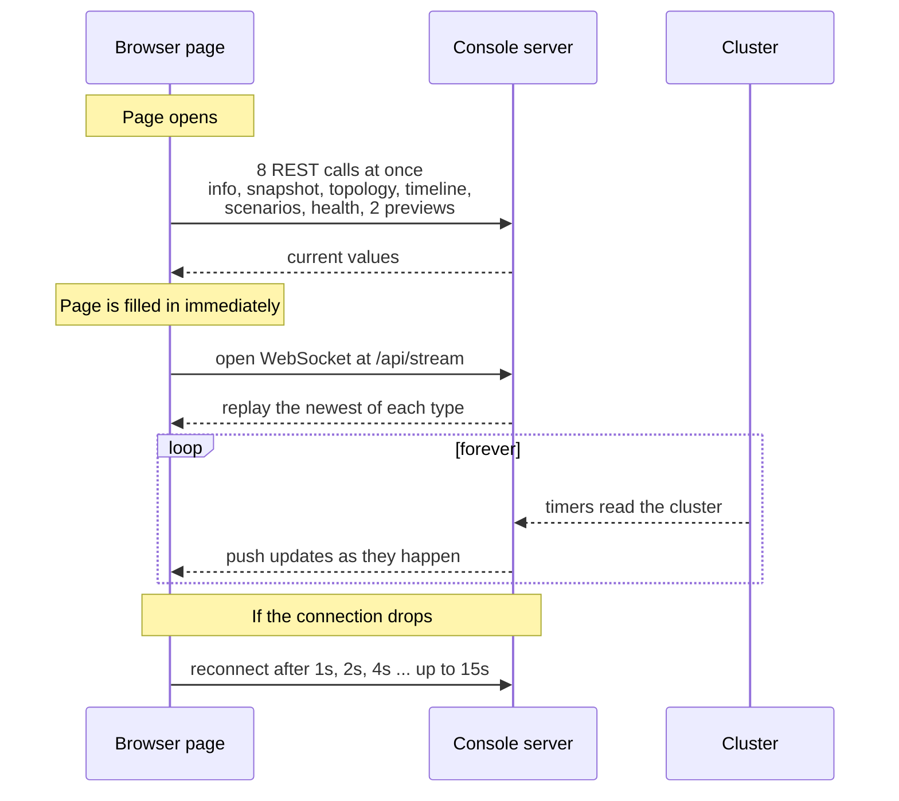
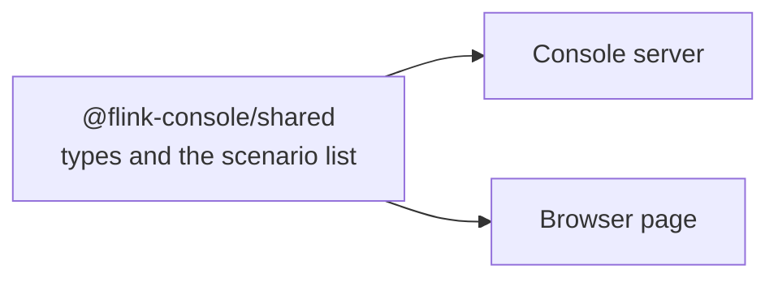

# Frontend Documentation

This document explains the **web console** — the page you open in your browser
to watch the Flink job and run the test scenarios.

The language is kept simple. Technical words are explained when they first appear.

**Related documents:** [`SETUP-AND-RUN.md`](SETUP-AND-RUN.md) · [`BACKEND.md`](BACKEND.md)

---

## Table of contents

1. [What the console is](#1-what-the-console-is)
2. [How to start it](#2-how-to-start-it)
3. [Technology used](#3-technology-used)
4. [What the page looks like](#4-what-the-page-looks-like)
5. [How data reaches the page](#5-how-data-reaches-the-page)
6. [State management](#6-state-management)
7. [The components, one by one](#7-the-components-one-by-one)
8. [The shared types package](#8-the-shared-types-package)
9. [Building and developing](#9-building-and-developing)
10. [Design decisions and why](#10-design-decisions-and-why)

---

## 1. What the console is

The console is a **single-page application** — a web page that loads once and
then updates itself, without ever reloading.

It shows four things:

| Panel | Shows |
|---|---|
| **Data-flow topology** | A live diagram of the whole pipeline, with numbers on each box |
| **Topic preview** | The actual messages going in and coming out of Kafka |
| **Elasticity telemetry** | Charts of TaskManagers, parallelism, busy time, backlog, and more |
| **Scenarios and load control** | Buttons to run tests and change the load, with live logs |

**What it does not do.** The console never repeats logic that already exists.
It runs the same `scripts/sN-*.sh` files you would run in a terminal, and reads
the same numbers. If the console and the terminal ever disagreed, one would have
to be wrong — so there is only one source of truth.

It also does not replace the official Flink web page. That page shows deep
Flink internals; this console shows the elasticity story.

---

## 2. How to start it

```bash
# Read-only. You can look, but you cannot change anything.
scripts/console.sh

# Operate mode. You can also change the load and run scenarios.
scripts/console.sh --operate
```

Then open **http://127.0.0.1:8088** in your browser.

The first run installs and builds everything automatically, which takes a few
minutes. Later runs start in seconds.

**The two modes:**

| | Read-only | Operate |
|---|---|---|
| See the diagram, charts, previews, logs | Yes | Yes |
| Run S1 (which changes nothing) | Yes | Yes |
| Change the load generator rate | No | Yes |
| Run S2 to S7 | No | Yes |

In operate mode, a small window still asks you to confirm before **every**
change. Nothing happens by a single accidental click.

The current mode is always visible in the top right corner of the page:
green means read-only, red means operate.

---

## 3. Technology used

| Library | Version | What it does here |
|---|---|---|
| **React** | 18.3.1 | Builds the page out of reusable components |
| **TypeScript** | 5.6.2 | JavaScript with type checking, so mistakes are caught before running |
| **Vite** | 5.4.8 | Development server and build tool. Very fast |
| **Tailwind CSS** | 3.4.13 | Styling written directly as class names, like `text-sm` or `bg-slate-900` |
| **React Flow** | 11.11.4 | Draws the node-and-arrow diagram |
| **Recharts** | 2.12.7 | Draws the line charts |

**File layout:**

```text
console/frontend/
├── index.html                  # the empty page React fills in
├── vite.config.ts              # build and dev-server settings
├── tailwind.config.js          # styling settings
├── package.json                # library list
└── src/
    ├── main.tsx                # start-up
    ├── App.tsx                 # the whole page layout
    ├── index.css               # three Tailwind lines plus a height fix
    ├── lib/
    │   ├── api.ts              # all HTTP calls in one place
    │   ├── useConsoleStream.ts # the WebSocket connection
    │   └── state.ts            # how state changes
    └── components/
        ├── HealthBar.tsx       # the row of coloured dots
        ├── TopologyCanvas.tsx  # the diagram
        ├── topologyNodes.tsx   # the boxes inside the diagram
        ├── TopicPreview.tsx    # Kafka message tables
        ├── TelemetryDashboard.tsx  # tiles and charts
        ├── ScenarioPanel.tsx   # scenario buttons and logs
        ├── LoadControl.tsx     # the rate input box
        └── ConfirmDialog.tsx   # the "are you sure?" window
```

---

## 4. What the page looks like

```text
┌──────────────────────────────────────────────────────────────────────┐
│  Flink Elasticity Console                        [ operate mode ]    │
│  Live data flow, telemetry, and scenario execution                   │
├──────────────────────────────────────────────────────────────────────┤
│  ● stream   ● Kubernetes   ● Flink REST   ● Kafka   ● MinIO          │  ← HealthBar
├──────────────────────────────────────────────────────────────────────┤
│  DATA-FLOW TOPOLOGY                                                  │
│  ┌────────┐   ┌────────┐   ┌────────┐   ┌────────┐   ┌────────┐      │
│  │Loadgen │──▶│events- │──▶│ Kafka  │──▶│Running │──▶│Sliding │ ...  │  ← TopologyCanvas
│  │ 50/s   │   │  in    │   │ Source │   │ Total  │   │ Window │      │
│  └────────┘   └────────┘   └────────┘   └───┬────┘   └───┬────┘      │
│                                             ╎            ╎           │
│                                        ┌────▼────────────▼───┐       │
│                                        │   MinIO Storage     │       │
│                                        └─────────────────────┘       │
├──────────────────────────────────────────────────────────────────────┤
│  TOPIC PREVIEW                                                       │
│  ┌───────────────────────────┐  ┌───────────────────────────┐        │
│  │ events-in     50 msg/s    │  │ events-out    20 msg/s    │        │  ← TopicPreview ×2
│  │ device_id  type  value    │  │ device_id count avg  ...  │        │
│  │ device-042 temp  73.4     │  │ device-042  6   51.2      │        │
│  └───────────────────────────┘  └───────────────────────────┘        │
├──────────────────────────────────────────────────────────────────────┤
│  ELASTICITY TELEMETRY                                                │
│  [Job state][TaskManagers][Max par.][TM size][pendingRecords] ...    │  ← stat tiles
│  ┌─────────────┐ ┌─────────────┐ ┌─────────────┐ ┌─────────────┐     │
│  │ TMs & per-  │ │ Busiest     │ │ Backlog     │ │ Checkpoint  │     │  ← 4 charts
│  │ vertex par. │ │ vertex busy │ │ vs lag      │ │ age & load  │     │
│  └─────────────┘ └─────────────┘ └─────────────┘ └─────────────┘     │
├──────────────────────────────────────────────────────────────────────┤
│  SCENARIOS & LOAD CONTROL                                            │
│  Load control:  [ 3000 ] [Apply]      current: 50 events/s           │  ← LoadControl
│  ┌───────────────────────────┐  ┌───────────────────────────┐        │
│  │ S1 Baseline       [idle]  │  │ S7 log            [pass]  │        │
│  │ S2 Scale-up   [mutating]  │  │ Window A result: busy=183 │        │  ← ScenarioPanel
│  │ ...                       │  │ PASS S7 vertical-scale... │        │
│  │ S7 Vertical scale [pass]  │  │                           │        │
│  └───────────────────────────┘  └───────────────────────────┘        │
└──────────────────────────────────────────────────────────────────────┘
```

The whole layout lives in `App.tsx` and is only about 100 lines, because every
section is its own component.

---

## 5. How data reaches the page

Data arrives in **two ways**: once at the start, then continuously.



### Step 1 — the first load

`useConsoleStream.ts` fires eight REST requests at the same time:

```ts
const [info, snapshot, topology, timeline, scenarios, health, inPreview, outPreview] =
  await Promise.allSettled([
    api.info(), api.snapshot(), api.topology(), api.timeline(),
    api.scenarios(), api.health(), api.preview('events-in'), api.preview('events-out'),
  ]);
```

**`Promise.allSettled` is important.** It waits for all eight, and does **not**
fail if some fail. So if Kafka is down and the preview request fails, the other
seven still fill the page. A helper called `unwrap` simply returns `undefined`
for the failed ones.

### Step 2 — live updates

A WebSocket connection stays open. A WebSocket is a two-way channel that stays
open, so the server can send data at any moment without the browser asking.

```ts
const proto = window.location.protocol === 'https:' ? 'wss' : 'ws';
socket = new WebSocket(`${proto}://${window.location.host}/api/stream`);
```

### Step 3 — reconnecting

If the connection drops — for example because you restarted the server — the
page reconnects by itself:

```ts
const delay = backoffRef.current;
backoffRef.current = Math.min(delay * 2, MAX_BACKOFF_MS);
reconnectTimer = setTimeout(connect, delay);
```

The wait doubles each time: 1 s, 2 s, 4 s, 8 s, then stays at 15 s. This is
called **exponential backoff**. On a successful connection the wait resets to
1 second.

You never need to reload the page.

### The messages that arrive

| Message type | Contains | How often |
|---|---|---|
| `serverInfo` | Version, operate mode, scenario list | Once, on connect |
| `snapshot` | Job state, TM count, TM size, backlog, checkpoint age | Every ~3 s |
| `metricSample` | One point for the charts | Every ~3 s |
| `topology` | The whole diagram | Every ~3 s |
| `signalHealth` | Status of each source | Every 3 s |
| `topicPreview` | Recent Kafka messages | Every ~12 s |
| `scenarioLog` | One line of script output | While a scenario runs |
| `scenarioState` | idle / running / pass / fail | On every change |

---

## 6. State management

All the page's data lives in **one object**, changed by **one function**. React
calls this pattern a **reducer**.

```ts
export interface AppState {
  serverInfo?: ServerInfo;                                   // version, mode, scenario list
  snapshot?: ClusterSnapshot;                                // newest cluster values
  topology?: TopologyDocument;                               // the diagram
  timeline: MetricSample[];                                  // chart history
  previews: Partial<Record<PreviewTopic, TopicPreviewBatch>>;// Kafka samples
  scenarios: Partial<Record<ScenarioId, ScenarioState>>;     // status per scenario
  scenarioLogs: Partial<Record<ScenarioId, ScenarioLogLine[]>>; // logs per scenario
  health: SignalHealth[];                                    // per-source status
  wsConnected: boolean;                                      // is the stream alive
}
```

The reducer accepts three kinds of action:

| Action | When |
|---|---|
| `bootstrap` | The eight first REST calls came back |
| `stream` | A WebSocket message arrived |
| `wsStatus` | The connection opened or closed |

**Two limits stop the page growing forever:**

```ts
const MAX_TIMELINE_SAMPLES = 240;   // about 12 minutes at one sample per 3 s
const MAX_LOG_LINES = 500;          // per scenario
```

When the limit is reached the oldest entry is dropped. A console left open all
day therefore uses a steady, small amount of memory.

**One small but nice behaviour:** when a scenario starts running, its old log is
cleared automatically:

```ts
if (message.payload.status === 'running') {
  scenarioLogs[message.payload.id] = [];
}
```

So you never see the previous run's output mixed with the new one.

---

## 7. The components, one by one

### 7.1 `App.tsx` — the layout

Calls `useConsoleStream()` once, then passes pieces of the state down to each
component. It also defines a small helper:

```tsx
function UnavailableBanner({ reason }: { reason?: string }) {
  if (!reason) return null;
  return <div className="...amber...">Signal unavailable: {reason}</div>;
}
```

This puts a yellow warning above a section whose data source is down — so you
see *why* a panel is empty, instead of guessing.

### 7.2 `HealthBar.tsx` — the row of dots

A thin strip at the top with one dot per data source.

| Dot colour | Meaning |
|---|---|
| Green | Working |
| Red | Not available (hover to see the reason) |
| Grey | Not checked yet |

The first dot is the WebSocket itself. When it is disconnected it turns amber
and **pulses**, so you can tell "the console lost its connection" apart from
"the cluster has a problem".

This bar is the first place to look when something seems wrong.

### 7.3 `TopologyCanvas.tsx` — the diagram

Draws the pipeline using React Flow.

**Layout.** Positions are calculated, not stored:

```ts
const COLUMN_WIDTH = 220;
const MAIN_ROW_Y = 120;
const STORAGE_ROW_Y = 320;
```

The main pipeline is one horizontal row. The MinIO box sits below, centred
under the boxes that feed it — the code averages their x positions.

**The arrows carry meaning:**

| Look | Meaning |
|---|---|
| Moving (animated) | Data is flowing right now |
| Still | Rate is zero |
| Blue, 2 px | Normal |
| Red, 3 px | Backpressure above 50 % — this step cannot keep up |
| Green dashed | Saving state to MinIO |
| Label like `1204/s` | Records per second on that arrow |

**Backpressure** means a step is being slowed down because the next step is
too busy. A red arrow points straight at your bottleneck.

Nodes cannot be dragged or connected (`draggable: false`,
`nodesConnectable={false}`). This is a picture to read, not a diagram to edit.

If no topology has arrived yet, a grey box says
*"Topology unavailable — waiting for the backend."* rather than showing nothing.

### 7.4 `topologyNodes.tsx` — the boxes

Four box designs, each with its own colour so you can tell them apart at a glance:

| Box type | Colour | Shows |
|---|---|---|
| `LoadgenNodeView` | Sky blue | Target rate |
| `KafkaTopicNodeView` | Amber | Partitions, rate, `pendingRecords`, lag |
| `FlinkVertexNodeView` | Indigo (red when backpressured) | Parallelism `p=`, busy %, backpressure %, output rate |
| `StorageLaneNodeView` | Emerald green | Checkpoint count, savepoint count, checkpoint age |

**A deliberate visual choice** in the Kafka box:

```tsx
{k?.pendingRecords !== undefined && (
  <div className="font-medium text-emerald-400">pendingRecords: {...}</div>
)}
{k?.committedLag !== undefined && (
  <div className="text-slate-500">lag (info): {...}</div>
)}
```

`pendingRecords` is bright green and bold — it is the number that tells the
truth. Kafka's `lag` is dim grey and labelled `(info)` — it swings up and down
for reasons that have nothing to do with the job's health. The styling teaches
you which number to trust.

The storage box is the only one you can click: it collapses and expands.

### 7.5 `TopicPreview.tsx` — real Kafka messages

Shows the last few real messages, so you can confirm data is really flowing.

The two topics carry different shapes, so there are two tables:

| Topic | Columns |
|---|---|
| `events-in` | `device_id`, `event_type`, `value`, `ts` |
| `events-out` | `device_id`, `count`, `avg_value`, `running_total`, window time range |

Shapes are detected by checking which fields exist:

```ts
function isInputEvent(v: unknown): v is InputEventRecord {
  return typeof v === 'object' && v !== null && ('device_id' in v || 'event_type' in v);
}
```

If a message cannot be parsed as JSON, the first 40 characters of the raw text
are shown instead. A broken message never breaks the table.

The header shows the measured rate, for example `50 msg/s observed`. This comes
from comparing Kafka offsets between two polls, not from counting the rows —
see [`BACKEND.md` section 5.3](BACKEND.md#53-the-access-layer).

### 7.6 `TelemetryDashboard.tsx` — tiles and charts

The most information-dense panel. Two parts.

**Part 1 — stat tiles.** Nine small boxes with the current values:

| Tile | Note |
|---|---|
| Job state | RUNNING, SUSPENDED, RECONCILING |
| TaskManagers | The horizontal scaling number |
| Max parallelism | Highest across all steps |
| **TM size** | For example `0.5 cpu · 1536m`. The vertical scaling number |
| pendingRecords | Green and marked *authoritative backlog* |
| Consumer lag | Grey and marked *informational only* |
| Checkpoint age | Seconds since the last finished checkpoint |
| Checkpoints | Total count in MinIO |
| Savepoints | Total count in MinIO |

Below the tiles, the latest autoscaler message appears in a blue box when there
is one — so you can read the scaler's own words, for example
*"Parallelism 1 → 2"*.

**Part 2 — four line charts.**

| Chart | Lines | What it tells you |
|---|---|---|
| **TaskManagers and per-vertex parallelism** | TM count, plus one line per vertex | The horizontal story. You can see one step scale while others stay put |
| **Busiest vertex busy (%)** | Busy percentage, 0–100 | The vertical story. It steps down when the TaskManager gets bigger |
| **Backlog: pendingRecords vs lag** | Both backlog numbers | Shows the difference between the true backlog and Kafka's saw-toothed lag |
| **Checkpoint age and load rate** | Both | Confirms snapshots keep happening under load |

**Making the vertex lines work.** Charts need flat rows, but the data arrives as
a map of vertex names. So the component flattens it when drawing:

```ts
const vertexKeys = [...keys].sort();
const rows = timeline.map((s) => {
  const row: ChartRow = { ...s };
  for (const k of vertexKeys) row[`vp_${k}`] = s.vertexParallelism?.[k];
  row.busyPct = s.maxVertexBusy !== undefined ? Math.round(s.maxVertexBusy * 100) : undefined;
  return row;
});
```

Sorting the keys keeps each vertex on the same colour between renders.

**The parallelism lines use `type="stepAfter"`.** Parallelism jumps from 1 to 2
instantly — it is never 1.5. A stepped line tells that truth; a smooth line
would draw a gentle slope that never happened.

**Colours.** The series colours come from a palette checked for colour-blind
readability, so lines stay distinguishable for people with common forms of
colour vision deficiency:

```ts
const TM_COLOR = '#3987e5';                                  // blue
const VERTEX_COLORS = ['#d95926', '#199e70', '#c98500'];     // orange, green, yellow
const BUSY_COLOR = '#d55181';                                // magenta
```

**Gaps in the lines are honest.** During a resize the job is down for about 100
seconds and reports nothing. The charts leave a gap there instead of drawing a
straight line across, because the job really was not running.

### 7.7 `ScenarioPanel.tsx` — running the tests

Two columns: the scenario list on the left, the log of the selected one on the right.

**Each scenario card shows:**

- Name, for example `S7 · Vertical scale`
- An amber `mutating` badge if it changes the cluster
- A status badge: `idle`, `running`, `pass`, `fail`, or `error`
- A one-line description
- A **Run** button

**Three rules protect you:**

1. **Buttons are disabled** when the console is read-only, or when any scenario
   is already running:
   ```ts
   const disabled = !operateMode || anyRunning;
   ```
2. **Mutating scenarios ask first.** Clicking Run opens a confirm window that
   names the scenario and repeats what it will do. S1 changes nothing, so it
   starts immediately.
3. **The view follows the action.** When a scenario starts, the log panel
   switches to it automatically:
   ```ts
   useEffect(() => {
     const running = scenarios.find((s) => states[s.id]?.status === 'running');
     if (running) setSelected(running.id);
   }, [states, scenarios]);
   ```

**The log panel** shows the script's output live, in a fixed-height scrolling
box with a monospace font — exactly what you would see in a terminal.

When the scenario finishes, the parsed result appears underneath: the full
summary line, and the `name: value` pairs in a small grid. For example:

```text
PASS S7 vertical-scale base_cpu=0.5 new_cpu=1 busy_before=183 busy_after=74 resize_gap_s=103 tm_count=1

base_cpu: 0.5        new_cpu: 1
busy_before: 183     busy_after: 74
resize_gap_s: 103    tm_count: 1
```

**Notice the scenario list is not written into this component.** It arrives from
the server as `serverInfo.scenarios`. That is why S7 appeared in the page the
moment it was added to the shared list — no frontend change was needed.

### 7.8 `LoadControl.tsx` — changing the rate

A text box, an Apply button, and the current rate.

**Validation happens twice, on purpose:**

```ts
// in the browser
const validate = (raw: string): number | undefined => {
  if (!/^\d+$/.test(raw.trim())) return undefined;
  const n = Number.parseInt(raw, 10);
  return n > 0 ? n : undefined;
};
```

The browser check gives instant feedback. The server checks again anyway,
because a browser check can always be bypassed. **Never trust the client** is
the rule.

A valid number opens a confirm window: *"Set the load generator to 3000
events/s?"* Only after confirming is the request sent.

In read-only mode the input is disabled and a message explains how to enable it.

### 7.9 `ConfirmDialog.tsx` — the "are you sure?" window

A small shared component: a title, a message, Cancel and Confirm. The confirm
button is red, because it is used for actions that change things.

It is used in two places — load changes and mutating scenarios — so the
confirmation experience is identical everywhere.

---

## 8. The shared types package

`console/shared/src/index.ts` is a small package used by **both** the server and
the browser.



It contains no logic — only TypeScript type definitions plus one constant list:

| Export | What it is |
|---|---|
| `ClusterSnapshot` | The current cluster values |
| `MetricSample` | One point on the charts |
| `TopologyDocument`, `TopologyNode`, `TopologyEdge` | The diagram shape |
| `TopicPreviewBatch`, `InputEventRecord`, `AggregateResultRecord` | Kafka message shapes |
| `ScenarioId`, `ScenarioDescriptor`, `ScenarioState`, `ScenarioResult` | Scenario shapes |
| `SignalHealth`, `SignalSource` | Health shapes |
| `StreamMessage` | Every possible WebSocket message |
| `SCENARIOS` | **The one list of scenarios**, used by both sides |

**Why this matters.** If the server sends a field the browser does not expect,
TypeScript reports an error at build time — not as a blank panel at runtime.

`StreamMessage` is a **discriminated union**. Each message has a `type` field,
and once you check that field TypeScript knows exactly what `payload` contains:

```ts
export type StreamMessage =
  | { type: 'topology';      payload: TopologyDocument }
  | { type: 'snapshot';      payload: ClusterSnapshot }
  | { type: 'metricSample';  payload: MetricSample }
  | ...
```

This is why the reducer's `switch` statement is fully type-safe.

**Adding a scenario is a one-line change here:**

```ts
export type ScenarioId = 's1' | 's2' | 's3' | 's4' | 's5' | 's6' | 's7';

export const SCENARIOS: ScenarioDescriptor[] = [
  ...
  {
    id: 's7',
    name: 'Vertical scale',
    script: 's7-vertical-scale.sh',
    description: 'Enlarge the TaskManager at constant parallelism; compare busy-time and measure the resize gap.',
    mutating: true,
  },
];
```

The server picks it up as an allowed script. The browser picks it up as a new
card. Neither needed any other change.

---

## 9. Building and developing

The console is an **npm workspace** — one project containing three packages
that depend on each other.

```text
console/
├── package.json     (workspace root)
├── shared/          → must be built first
├── backend/         → uses shared
└── frontend/        → uses shared
```

### Commands

```bash
cd console

npm install          # install everything, once

npm run build        # build all three, in the right order
npm run typecheck    # check types without producing files
npm run lint         # ESLint
npm run format       # Prettier check
```

The build order matters and is written into the root `package.json`:

```json
"build": "npm run build:shared && npm run build:frontend && npm run build:backend"
```

`shared` is first because the other two import it.

### Developing the page with instant reload

```bash
# terminal 1 — the server
node backend/dist/index.js --operate

# terminal 2 — the dev server
npm run dev --workspace @flink-console/frontend
```

Open **http://localhost:5173**. Saving a file updates the browser in under a
second.

This works because Vite forwards API calls to the real server:

```ts
server: {
  port: 5173,
  proxy: {
    '/api': { target: 'http://127.0.0.1:8088', changeOrigin: true, ws: true },
  },
}
```

`ws: true` is what makes the WebSocket work through the proxy as well.

### How the built page is served

In production there is no second server. Vite writes static files into
`frontend/dist`, and the Fastify server serves them:

```ts
if (fs.existsSync(config.frontendDir)) {
  await app.register(fastifyStatic, { root: config.frontendDir, prefix: '/' });
  app.setNotFoundHandler((request, reply) => {
    if (request.raw.url?.startsWith('/api')) {
      return reply.code(404).send({ ok: false, message: 'Not found' });
    }
    return reply.sendFile('index.html');
  });
}
```

The not-found handler splits the two worlds: unknown `/api/...` paths return a
proper 404, while any other unknown path returns `index.html` so the
single-page app can handle it.

### Styling

Tailwind CSS means styles are written as class names right next to the markup:

```tsx
<div className="rounded-lg border border-slate-800 bg-slate-900/40 px-3 py-2">
```

There is almost no separate CSS. `index.css` is only seven lines:

```css
@tailwind base;
@tailwind components;
@tailwind utilities;

html, body, #root { height: 100%; }
```

The page uses a **dark theme** throughout (`bg-slate-950` on the body). Dark
suits a monitoring screen that stays open for a long time, and it makes the
coloured status dots and chart lines stand out.

---

## 10. Design decisions and why

### The server does the work, the browser only draws

The browser receives clean, small JSON. It never talks to Kubernetes, Kafka, or
Flink directly.

**Why:** the browser has no cluster credentials, cannot resolve internal cluster
names, and cannot run shell commands. Keeping all of that on the server also
means no secret ever reaches the browser.

### One WebSocket, not repeated polling

**Why:** polling would either be slow to update or would flood the server.
Updates arrive exactly when something happens.

### Every panel fails on its own

If Kafka is down, the Kafka panel says *unavailable* and everything else keeps
working.

**Why:** a monitoring tool that goes blank when one part breaks is useless
exactly when you need it most.

### Everything says what it means

- The mode badge says `read-only mode` or `operate mode`.
- A dot's tooltip gives the real failure reason.
- `pendingRecords` says *authoritative backlog*; lag says *informational only*.
- Mutating scenarios carry a `mutating` badge.

**Why:** a console for a system that changes itself must be honest about what
is happening and what you are about to do.

### Confirm before every change

**Why:** these actions restart a stateful job. A confirmation step costs one
second and prevents an accidental 100-second outage.

### Config comes from the server, not the code

The scenario list, the operate flag, and the version all arrive from
`/api/info`.

**Why:** it keeps one source of truth. When S7 was added to the shared list, the
page showed it with no frontend edit at all.

### Bounded memory everywhere

240 chart points, 500 log lines per scenario, oldest dropped first.

**Why:** the console is meant to stay open during a 25-minute scenario, or all
day. Unbounded growth would eventually freeze the browser tab.
