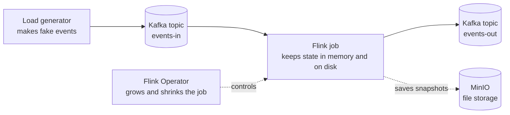
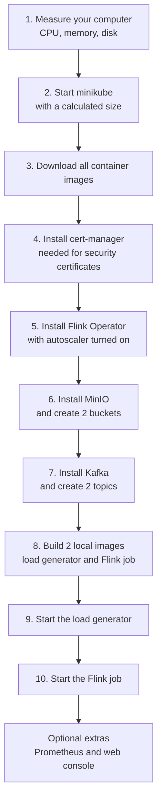

# Setup and Run Guide

This guide shows you how to install this project and run it, step by step.
It is written in plain English. Every technical word is explained the first
time it is used.

**Related documents**

- [`BACKEND.md`](BACKEND.md) — the Java job, every Kubernetes YAML file, and the console server.
- [`FRONTEND.md`](FRONTEND.md) — the web console user interface.

---

## Table of contents

1. [What this project is](#1-what-this-project-is)
2. [What you need before you start](#2-what-you-need-before-you-start)
3. [What the setup script does](#3-what-the-setup-script-does)
4. [Step 1 — Install everything](#4-step-1--install-everything)
5. [Step 2 — Check that it works](#5-step-2--check-that-it-works)
6. [Step 3 — Run the scenarios](#6-step-3--run-the-scenarios)
7. [Step 4 — Open the web console](#7-step-4--open-the-web-console)
8. [Watching what happens](#8-watching-what-happens)
9. [Changing the load by hand](#9-changing-the-load-by-hand)
10. [When something goes wrong](#10-when-something-goes-wrong)
11. [Removing everything](#11-removing-everything)
12. [Quick reference card](#12-quick-reference-card)

---

## 1. What this project is

This project runs a **stream processing job** on one Linux computer. A stream
processing job reads data that never stops arriving, and keeps calculating
results as the data flows in.

The job here is written in Apache Flink. It reads sensor events from Kafka,
keeps a running total for each device, calculates averages over time windows,
and writes the results back to Kafka.

The interesting part is **elasticity**. Elasticity means the system can grow
when there is a lot of work and shrink when there is little work — without
losing any data. This project proves that with seven test scenarios, named S1
to S7. Each scenario prints `PASS` or `FAIL` at the end.



**Words you will see often:**

| Word | Simple meaning |
|---|---|
| **Kubernetes** | Software that starts, stops, and restarts programs for you. Often written as **k8s**. |
| **minikube** | A small Kubernetes that runs on one computer, for testing. |
| **Pod** | One running program inside Kubernetes. The smallest unit you can start. |
| **Namespace** | A folder inside Kubernetes that keeps related pods together. |
| **Kafka** | A message queue. Programs write messages into it, other programs read them. |
| **Topic** | One named channel inside Kafka. This project uses `events-in` and `events-out`. |
| **MinIO** | A storage server that behaves like Amazon S3. It stores files. |
| **TaskManager** | A Flink worker pod. It does the real data processing. Often written as **TM**. |
| **JobManager** | The Flink boss pod. It gives work to the TaskManagers. Often written as **JM**. |
| **Parallelism** | How many copies of one processing step run at the same time. |
| **Checkpoint** | An automatic snapshot of the job, taken every 30 seconds, used to recover from crashes. |
| **Savepoint** | A snapshot you ask for on purpose, used to stop, resize, or upgrade the job. |

---

## 2. What you need before you start

### Hardware

| Item | Recommended | Minimum |
|---|---|---|
| CPU cores | 8 | 4 |
| Memory (RAM) | 16 GB or more | 8 GB |
| Free disk space | 20 GB or more | 20 GB (required) |
| Operating system | Linux | Linux |

If your computer has fewer than 4 cores or less than 8 GB of memory, the setup
still runs, but it uses a smaller and simpler configuration. The setup script
warns you when this happens.

If you have less than 20 GB of free disk, the setup **stops with an error**.
This is on purpose — container images and storage volumes need that space.

### Software

Install these programs before you start. The setup script checks for them and
stops with a clear message if one is missing.

| Program | Why it is needed |
|---|---|
| `docker` | minikube runs Kubernetes inside Docker. |
| `minikube` | Creates the small Kubernetes cluster. |
| `kubectl` | The command you use to talk to Kubernetes. |
| `helm` | Installs bigger software packages into Kubernetes. |
| `openssl` | Creates random passwords for the storage server. |
| `nproc`, `free`, `df`, `awk` | Standard Linux tools. Used to measure your computer's size. |
| `python3` | Used by scenario S7 to calculate the new CPU value. |
| `node` and `npm` (version 20 or newer) | Only needed for the web console. |

Check that everything is there:

```bash
docker --version
minikube version
kubectl version --client
helm version
python3 --version
node --version    # only needed for the console
```

---

## 3. What the setup script does

The file `setup.sh` does everything in one command. It is **idempotent**, which
means you can run it again safely. It will not break things that already exist.

Here is the order of the work:



### How the script sizes minikube

The script does not use your whole computer. It leaves room for your desktop
and other programs:

- **CPU given to minikube** = your total cores − 2, but never less than 4 and never more than 8.
- **Memory given to minikube** = your total GB − 4, but never less than 8 and never more than 16.
- About **20 % is kept free** inside that budget, so the job has room to grow during tests.

### How the script chooses the Kafka type

There are two ways to install Kafka in this project:

| Condition | What is installed | Why |
|---|---|---|
| minikube gets **6 or more** CPUs | **Strimzi** — a Kafka operator, closer to real production | It needs more resources but behaves like a real setup |
| minikube gets **fewer than 6** CPUs | **Fallback** — one simple Kafka pod | Uses less memory and CPU, still works for all tests |

If Strimzi is chosen but fails to become ready in 3 minutes, the script
automatically deletes it and installs the fallback instead. You do not need to
do anything.

---

## 4. Step 1 — Install everything

Open a terminal and run:

```bash
cd flink-elasticity-poc
./setup.sh
```

This takes **10 to 25 minutes** the first time, because it downloads and builds
container images. Later runs are much faster.

**Optional extras:**

```bash
./setup.sh --with-metrics    # also install Prometheus for metrics
./setup.sh --with-console    # also install and build the web console
./setup.sh --with-metrics --with-console   # both
```

While it runs, the script prints a resource budget table. It looks like this:

```text
Resource Budget (Minikube envelope)
-----------------------------------
Host CPUs: 8
Host Memory(GB): 31
Minikube CPUs: 6
Minikube Memory(GB): 16
Kafka mode: Strimzi KRaft single-broker
```

Read this table. It tells you how big your cluster is and which Kafka you got.

When the script finishes you will see:

```text
[INFO] Setup complete
```

---

## 5. Step 2 — Check that it works

Run these two commands:

```bash
kubectl -n flink-jobs get flinkdeployment flink-elastic-job
kubectl -n flink-jobs get pods
```

**What you want to see:**

- In the first command: `jobManagerDeploymentStatus` is `READY` and the job state is `RUNNING`.
- In the second command: two pods running — one JobManager and one TaskManager.

Example of a healthy result:

```text
NAME                                READY   STATUS    RESTARTS   AGE
flink-elastic-job-58fbbdd74-sfjrl   1/1     Running   0          2m
flink-elastic-job-taskmanager-1-1   1/1     Running   0          1m
```

You can also check the other parts:

```bash
kubectl -n kafka get pods       # Kafka should be Running
kubectl -n storage get pods     # MinIO should be Running
kubectl -n loadgen get pods     # load generator should be Running
```

---

## 6. Step 3 — Run the scenarios

Each scenario is a shell script. It changes something, waits, measures the
result, and prints `PASS` or `FAIL` with numbers.

Run them **in this order**:

```bash
scripts/s1-baseline.sh        # check the system is calm and healthy
scripts/s2-scale-up.sh        # add load, watch it grow (horizontal)
scripts/s3-scale-down.sh      # remove load, watch it shrink (horizontal)
scripts/s4-suspend.sh         # stop the job, keep the data
scripts/s5-resume.sh          # start the job again, no data lost
scripts/s6-rescale-cost.sh    # measure how long a resize takes
scripts/s7-vertical-scale.sh  # make the worker bigger (vertical)
```

### What each scenario does and how long it takes

| Scenario | What it does | Typical time | Changes the cluster? |
|---|---|---|---|
| **S1** Baseline | Sets load to 50 events/s and checks the system is healthy | ~5 min | No |
| **S2** Scale-up | Raises load to 12,000 events/s so the autoscaler adds a TaskManager, then drains the backlog | ~10 min | Yes |
| **S3** Scale-down | Lowers the load and waits for the extra TaskManager to be removed | ~10 min | Yes |
| **S4** Suspend | Stops the job and saves a savepoint. All pods go away | ~2 min | Yes |
| **S5** Resume | Starts the job again from the savepoint and drains what piled up | ~5 min | Yes |
| **S6** Rescale cost | Changes parallelism twice and measures the restart gap each time | ~25 min | Yes |
| **S7** Vertical scale | Doubles the TaskManager CPU, measures the speed gain, then restores the original size | ~15 min | Yes |

### Understanding the result line

Every scenario ends with one line. For example:

```text
PASS S2 scale-up rate=12000 base_tm=1 max_tm=2 scaleup_in_s=207 drain_in_s=225
```

Read it like this:

- `PASS` — the test succeeded (`FAIL` means it did not).
- `S2 scale-up` — which scenario ran.
- `rate=12000` — the load used, in events per second.
- `base_tm=1 max_tm=2` — TaskManagers went from 1 to 2.
- `scaleup_in_s=207` — it took 207 seconds to grow.
- `drain_in_s=225` — it took 225 seconds to catch up afterwards.

### Tip: save long runs to a file

S2, S3, S6, and S7 take a long time and print many lines. Save the output to a
file so your terminal stays clean:

```bash
./scripts/s2-scale-up.sh > /tmp/s2.log 2>&1 &
tail -f /tmp/s2.log
```

Press `Ctrl+C` to stop watching. The script keeps running in the background.

---

## 7. Step 4 — Open the web console

The web console shows the same information as the scripts, but as pictures and
live charts in your browser.

### Two modes

| Mode | Command | What you can do |
|---|---|---|
| **Read-only** (default) | `scripts/console.sh` | Look at everything. Cannot change anything. Safe. |
| **Operate** | `scripts/console.sh --operate` | Look at everything **and** change the load and run scenarios. |

Start it:

```bash
scripts/console.sh --operate
```

Then open your browser at **http://127.0.0.1:8088**

The first run installs and builds the console automatically. This takes a few
minutes. Later runs start in seconds.

**Safety notes:**

- The console only listens on `127.0.0.1`. Nobody else on the network can reach it.
- Even in operate mode, the browser asks you to confirm before any change.
- Your Kubernetes password file is never sent to the browser.

For the full explanation of every panel and chart, read [`FRONTEND.md`](FRONTEND.md).

---

## 8. Watching what happens

Open a second terminal and run one of these while a scenario is running.

**Simple live overview:**

```bash
scripts/watch.sh
```

This refreshes every 10 seconds and shows: how many TaskManager pods exist,
the parallelism of each processing step, the Kafka backlog, and the last
decision the autoscaler made.

**The official Flink web page:**

```bash
scripts/ui.sh
```

Then open **http://localhost:8081** in your browser.

**Watch pods appear and disappear:**

```bash
kubectl get pods -n flink-jobs -w
```

The `-w` means "watch". Press `Ctrl+C` to stop.

**See the autoscaler's decisions:**

```bash
kubectl -n flink-jobs get events --sort-by=.lastTimestamp | grep -i scal
```

---

## 9. Changing the load by hand

You can set the number of events per second yourself:

```bash
scripts/set-load.sh 50       # calm, this is the normal baseline
scripts/set-load.sh 3000     # busy, but not enough to trigger growth
scripts/set-load.sh 12000    # very busy, one TaskManager cannot keep up
```

The number must be a whole number greater than zero.

**Useful values to know:**

- **50** — the resting level used by S1.
- **3000** — used by S7. Enough to measure speed, but low enough that the autoscaler stays quiet.
- **12000** — used by S2. This fully loads one TaskManager and forces the autoscaler to add another.

---

## 10. When something goes wrong

### The job will not start, and the operator complains about the version

**Symptom:** the Flink deployment is rejected, with a message about `flinkVersion`.

**Cause:** the file on disk asks for Flink 2.2 (`v2_2`). Some installed
operators only understand up to Flink 1.20 (`v1_20`).

**Fix:** make a copy of the file with the version changed, then apply the copy:

```bash
sed 's/flinkVersion: v2_2/flinkVersion: v1_20/' \
  manifests/flink-jobs/flink-job.yaml > /tmp/flink-job-live.yaml
kubectl -n flink-jobs apply -f /tmp/flink-job-live.yaml
```

### Kafka keeps dying and restarting

**Symptom:** the `kafka-0` pod restarts again and again, with `OOMKilled` in
its status. OOM means "out of memory".

**Cause:** Kafka command-line tools start a Java program **inside** the Kafka
pod. Those extra programs use memory that Kafka itself needs.

**Fix:** the project already handles this. Memory was raised to 1536Mi and all
tools now use a small memory limit. If you write your own commands that use
`kubectl exec` into the Kafka pod, always add this first:

```bash
export KAFKA_HEAP_OPTS="-Xmx128m -Xms64m"
```

Also do not run two such commands at the same time.

### S2 fails with "backlog did not build"

**Cause:** your computer is too small, so the load did not fill one TaskManager.

**Fix:** the script already lowers the target on smaller machines. If it still
fails, your computer may be below the minimum. Check the resource budget table
that `setup.sh` printed.

### S7 fails with "autoscaler interfered"

**Cause:** the measurement load was high enough to make the autoscaler add a
TaskManager. That ruins the measurement, so the script stops on purpose.

**Fix:** this is correct behavior, not a bug. It protects you from a wrong
result. Wait a few minutes for the cluster to settle, then run S7 again.

### The console page is empty or says "waiting for the backend"

**Checks to do, in order:**

1. Is the console running? Look at the terminal where you started it.
2. Is your Kubernetes context correct? Run `kubectl config current-context`. It should say `flink-elastic`.
3. Is the Flink job running? Run `kubectl -n flink-jobs get pods`.

The console shows a row of colored dots at the top. A red dot tells you exactly
which connection is broken.

### The suspend test leaves a pod behind

This is a known behavior of the installed Flink version. The JobManager pod
does not delete itself after a savepoint-suspend. The `s4-suspend.sh` script
already knows this and deletes it for you. Nothing to do.

---

## 11. Removing everything

To delete all the parts but keep the cluster:

```bash
./teardown.sh
```

This deletes the namespaces and then deletes the whole minikube profile.

To delete only the cluster yourself:

```bash
minikube delete -p flink-elastic
```

**Warning:** this removes all stored data, including checkpoints and savepoints.

---

## 12. Quick reference card

```bash
# ---------- Install ----------
cd flink-elasticity-poc
./setup.sh                       # basic install
./setup.sh --with-console        # also build the web console

# ---------- Check ----------
kubectl -n flink-jobs get flinkdeployment flink-elastic-job
kubectl -n flink-jobs get pods

# ---------- Watch (second terminal) ----------
scripts/watch.sh                 # text overview, refreshes every 10 s
scripts/ui.sh                    # Flink web page on localhost:8081

# ---------- Run tests ----------
scripts/s1-baseline.sh
scripts/s2-scale-up.sh
scripts/s3-scale-down.sh
scripts/s4-suspend.sh
scripts/s5-resume.sh
scripts/s6-rescale-cost.sh
scripts/s7-vertical-scale.sh

# ---------- Web console ----------
scripts/console.sh               # read-only
scripts/console.sh --operate     # can change things
# then open http://127.0.0.1:8088

# ---------- Load ----------
scripts/set-load.sh 50           # calm
scripts/set-load.sh 12000        # very busy

# ---------- Remove ----------
./teardown.sh
```

### Where things live

| What | Where |
|---|---|
| Flink job pods | namespace `flink-jobs` |
| Kafka | namespace `kafka` |
| MinIO storage | namespace `storage` |
| Load generator | namespace `loadgen` |
| Flink Operator | namespace `flink-operator` |
| Prometheus (optional) | namespace `metrics` |
| Checkpoints | `s3://checkpoints/flink-elastic` inside MinIO |
| Savepoints | `s3://savepoints/flink-elastic` inside MinIO |
